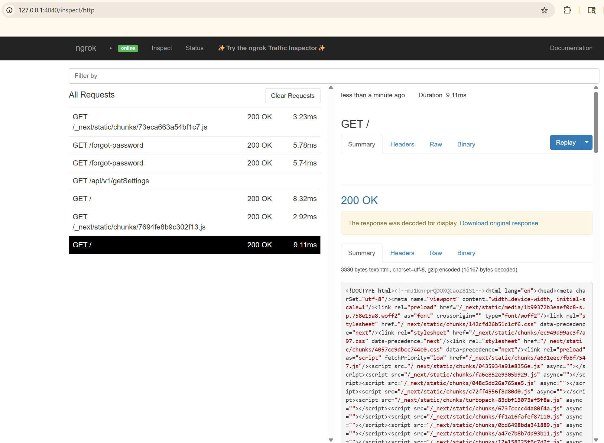

# Local Development with ngrok

[ngrok](https://ngrok.com/) exposes your local InstaCRUD instance to the internet, enabling OAuth callbacks, webhook testing, and sharing your development environment.

---

## Why Use ngrok?

- **OAuth Testing** — Google and Microsoft OAuth require HTTPS callback URLs
- **Webhook Development** — Test external service integrations locally
- **Mobile Testing** — Access your local app from mobile devices
- **Demo Sharing** — Share your work-in-progress with teammates

---

## Installation

### 1. Install ngrok

Download from [ngrok.com](https://ngrok.com/download) or use a package manager:

```bash
# macOS
brew install ngrok

# Windows (Chocolatey)
choco install ngrok

# Linux (snap)
snap install ngrok
```

### 2. Create Account and Authenticate

1. Sign up at [ngrok.com](https://ngrok.com/)
2. Copy your authtoken from the dashboard
3. Configure ngrok:

```bash
ngrok config add-authtoken YOUR_AUTH_TOKEN
```

---

## Docker Deployment (Recommended)

The ngrok free plan allows only one tunnel. This section shows how to deploy InstaCRUD with Docker, exposing a single nginx port that routes to both backend and frontend.

### Overview

```
ngrok (HTTPS) → nginx (:80) → backend (:8000) / frontend (:3000)
```

nginx handles path-based routing:
- `/api/*`, `/oauth/*`, `/docs`, `/openapi.json` → backend
- Everything else → frontend

### 1. Configure Environment

Create a `.env.vps` file (or export these variables):

```bash
# ngrok URL (get this after starting ngrok)
BASE_URL=https://your-tunnel.ngrok-free.dev

# SSL disabled - ngrok handles HTTPS
SSL_ENABLED=false

# Required secrets
MONGO_PASSWORD=your-secure-password
SECRET_KEY=your-jwt-secret

# OAuth (optional but recommended)
GOOGLE_CLIENT_ID=your-google-client-id
GOOGLE_CLIENT_SECRET=your-google-client-secret

# Turnstile (optional - use dummy mode for local dev)
TURNSTILE_MODE=dummy
```

### 2. Start ngrok

Start ngrok pointing to port 80:

```bash
ngrok http 80
```

ngrok displays a forwarding URL like:

```
Forwarding    https://abc123.ngrok-free.dev -> http://localhost:80
```

Copy this URL for the next step.

### 3. Update BASE_URL

Set the `BASE_URL` environment variable to your ngrok URL:

```bash
export BASE_URL=https://abc123.ngrok-free.dev
```

Or update your `.env.vps` file.

### 4. Build and Start Services

```bash
# Build and start services using environment variables from .env.vps
docker compose --env-file .env.vps -f docker-compose.vps.yml up -d --build
```

### 5. Initialize Database (First Run)

Create the admin user:

```bash
docker compose -f docker-compose.vps.yml exec -it backend poetry run python -m init.init
```

### 6. Access Your App

Open the ngrok URL in your browser:

```
https://abc123.ngrok-free.dev
```

---

## OAuth Configuration

When using ngrok for OAuth testing, update your provider settings:

### Google Cloud Console

1. Go to **APIs & Services > Credentials**
2. Edit your OAuth 2.0 Client ID
3. Add to **Authorized redirect URIs**:
   ```
   https://your-tunnel.ngrok-free.dev/oauth/google/callback
   ```

### Microsoft Azure Portal

1. Go to **App registrations > Your App > Authentication**
2. Add to **Redirect URIs**:
   ```
   https://your-tunnel.ngrok-free.dev/oauth/microsoft/callback
   ```

---

## Local Development (Without Docker)

For local development without Docker, you can run the backend and frontend directly and use two ngrok tunnels (requires paid plan) or use the Docker method above.

### Backend Only

Expose the backend API on port 8000:

```bash
ngrok http 8000
```

### Backend and Frontend (Two Tunnels - Paid Plan)

Running two simultaneous tunnels requires a paid plan (free plan allows only one).

**Terminal 1 — Backend:**

```bash
ngrok http 8000 --domain=your-backend-domain.ngrok-free.dev
```

**Terminal 2 — Frontend:**

```bash
ngrok http 3000 --domain=your-frontend-domain.ngrok-free.dev
```

Update environment variables:

```bash
# Backend (.env)
BASE_URL=https://your-backend.ngrok-free.dev
FRONTEND_BASE_URL=https://your-frontend.ngrok-free.dev
CORS_ALLOW_ORIGINS=https://your-frontend.ngrok-free.dev,http://localhost:3000

# Frontend
NEXT_PUBLIC_API_BASE_URL=https://your-backend.ngrok-free.dev
```

---

## Tips

### Inspect Traffic

ngrok provides a web interface for inspecting requests:

```
http://127.0.0.1:4040
```



### Persistent URLs

ngrok provides **one free static domain** per account. To claim yours:

1. Log in to [ngrok dashboard](https://dashboard.ngrok.com/)
2. Go to **Universal Gateway > Domains** (or **Cloud Edge > Domains**)
3. Click **Create Domain** to get your free static domain

Your domain will look like `random-name-here.ngrok-free.dev` (assigned by ngrok, not customizable on free plan).

Use it with:

```bash
ngrok http 80 --domain=your-assigned-domain.ngrok-free.dev
```

Custom domain names (like `myapp.example.com`) require a paid plan.

:::note Free Plan Limitations
- **Interstitial page**: Visitors see a warning page they must click through
- **20,000 requests/month** and **1 GB bandwidth/month**
- **One tunnel** at a time
:::

### Configuration File

Create `~/.ngrok2/ngrok.yml` for persistent settings:

```yaml
version: "2"
authtoken: YOUR_AUTH_TOKEN
tunnels:
  instacrud:
    proto: http
    addr: 80
    domain: your-assigned-domain.ngrok-free.dev  # From ngrok dashboard
```

Start the tunnel:

```bash
ngrok start instacrud
```

### Stopping Services

```bash
docker compose -f docker-compose.vps.yml down
```

To also remove volumes (database data):

```bash
docker compose -f docker-compose.vps.yml down -v
```

---

## Troubleshooting

### Check service status

```bash
docker compose -f docker-compose.vps.yml ps
docker compose -f docker-compose.vps.yml logs -f nginx
```

### Verify nginx routing

```bash
# Should return backend health check
curl -I https://your-tunnel.ngrok-free.dev/api/health

# Should return frontend
curl -I https://your-tunnel.ngrok-free.dev/
```

### ngrok shows "Bad Gateway"

Ensure Docker services are running:

```bash
docker compose -f docker-compose.vps.yml ps
```

All services should show "Up" status.

---

## Summary

The Docker deployment method is recommended for ngrok:

1. Start ngrok pointing to port 80
2. Set `BASE_URL` to your ngrok URL
3. Set `SSL_ENABLED=false` (ngrok handles HTTPS)
4. Run `docker compose -f docker-compose.vps.yml up -d`

This approach:
- Works with ngrok's free plan (single tunnel)
- Uses the same compose file as VPS deployment
- nginx routes requests to backend/frontend based on path
