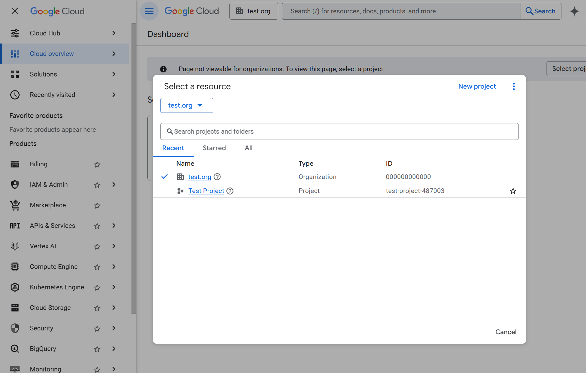
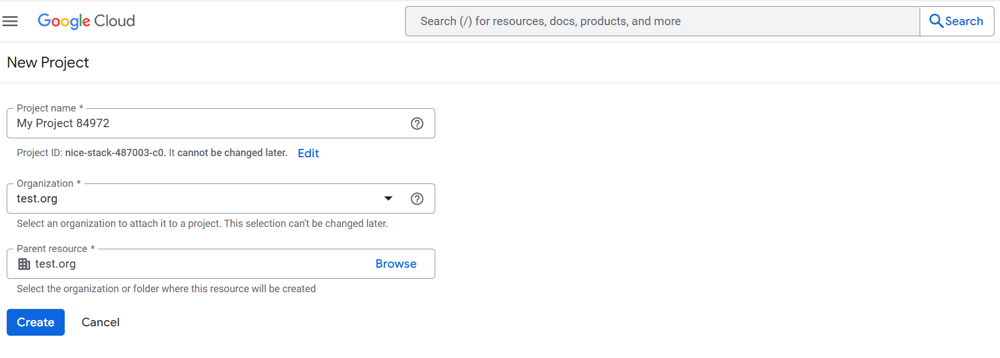
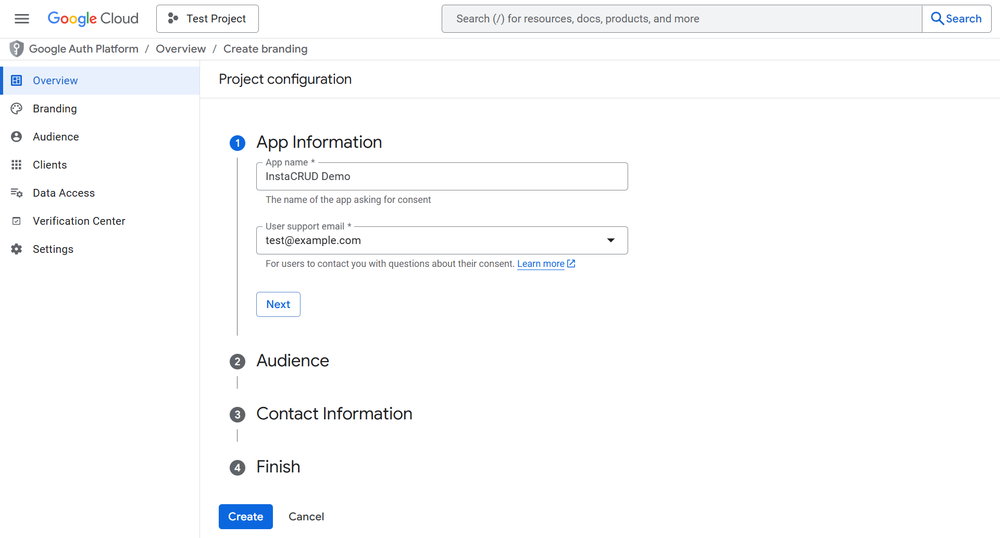
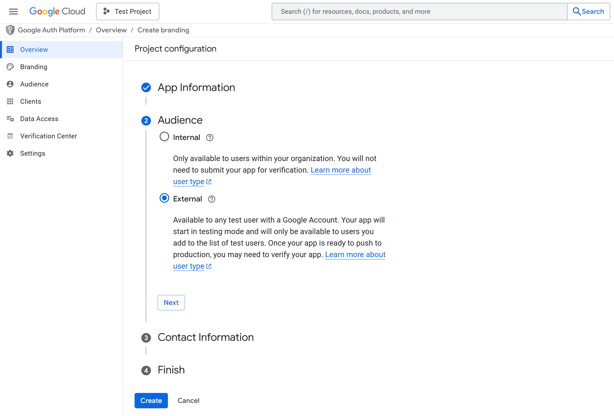
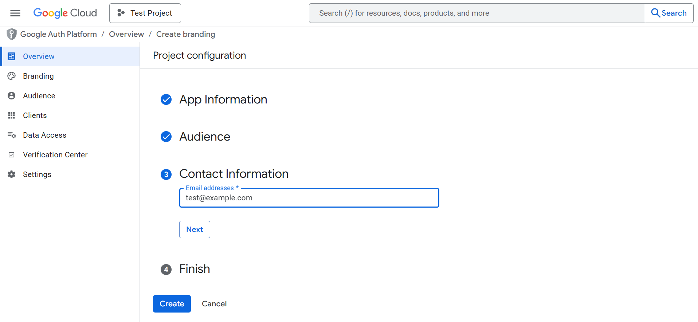
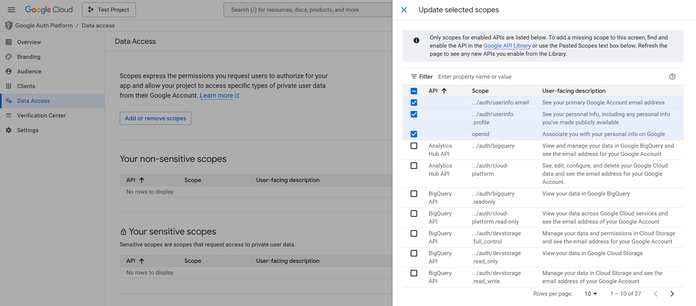
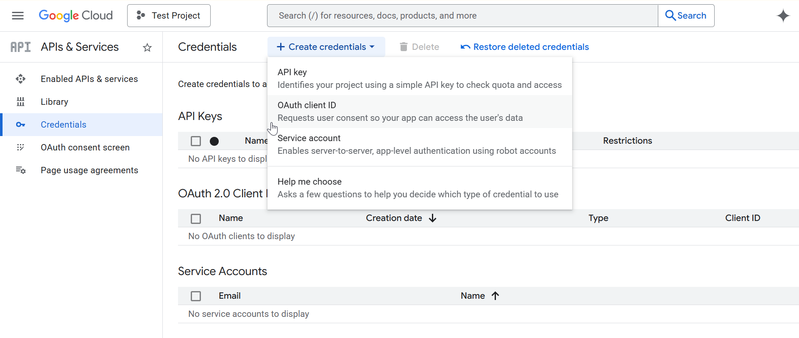
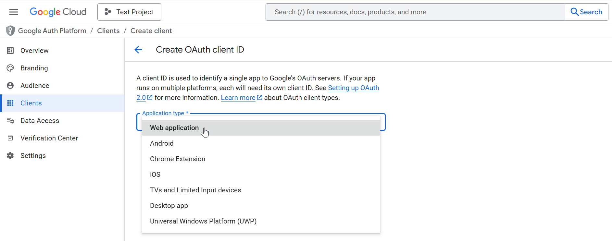
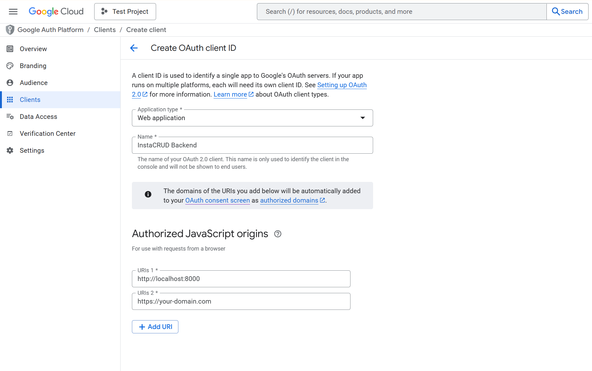
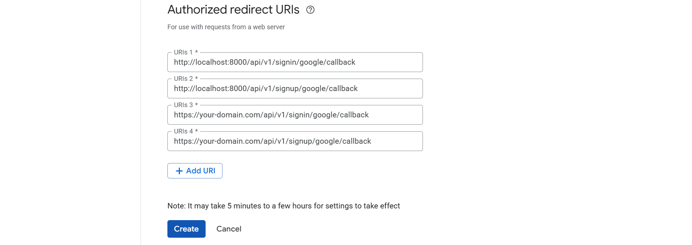

# OAuth with Google

Enable Google Sign-In for InstaCRUD users. This guide walks through setting up OAuth 2.0 credentials in Google Cloud Console.

---

## Overview

Google OAuth allows users to:

- Sign in with their Google account
- Skip manual registration
- Use their existing Google identity

---

## Step 1: Create Google Cloud Project

1. Go to [Google Cloud Console](https://console.cloud.google.com/)
2. Create a new project or select an existing one
3. Note your **Project ID**


*Google Cloud Console project selector. Use an existing project or click **New Project** to create one for InstaCRUD.*


*Creating a new Google Cloud project. Save the **Project ID** — it will be used internally by Google.*

---

## Step 2: Configure OAuth Consent Screen

1. Navigate to **APIs & Services > OAuth consent screen**
2. Click **Get started** button to configure OAuth
3. Fill in **App Information** fields:
   - **App name**: Your application name
   - **User support email**: Your email
4. Select **External** user type (or Internal for Google Workspace)
5. Fill in **Contact Information** fields:
   - **Email addresses**: Your email(s)
6. Check in **I agree to the Google API Services: User Data Policy**
7. Click **Create**


*OAuth consent screen configuration. Enter your application name and support email.*


*Selecting the OAuth user type. Choose **External** to allow any Google account to sign in.*


*Enter contact emails.*

### Scopes

Add these scopes:
- `email`
- `profile`
- `openid`


*Update selected scopes.*

### Test Users (Development)

While in testing mode, add email addresses of users who can test the OAuth flow.

---

## Step 3: Create OAuth Credentials

1. Go to **APIs & Services > Credentials**
2. Click **Create Credentials > OAuth client ID**
3. Select **Web application**
4. Configure:
   - **Name**: InstaCRUD Backend
   - **Authorized JavaScript origins**:
     ```
     http://localhost:3000
     https://your-domain.com
     ```
   - **Authorized redirect URIs**:
     ```
     http://localhost:8000/api/v1/signin/google/callback
     http://localhost:8000/api/v1/signup/google/callback
     https://your-domain.com/api/v1/signin/google/callback
     https://your-domain.com/api/v1/signup/google/callback
     ```

5. Click **Create**
6. Copy the **Client ID** and **Client Secret**









---

## Step 4: Configure InstaCRUD

Add credentials to your backend `.env` file:

```bash
# Google OAuth
GOOGLE_CLIENT_ID=your-client-id.apps.googleusercontent.com
GOOGLE_CLIENT_SECRET=your-client-secret
```

---

## Step 5: Verify Configuration

Restart the backend server. The OAuth endpoint should be available:

```
GET /api/v1/signin/google
```

This redirects users to Google's consent screen.

---

## Environment-Specific URLs

### Local Development

```
Authorized JavaScript origins:
  http://localhost:3000

Authorized redirect URIs:
  http://localhost:8000/api/v1/signin/google/callback
  http://localhost:8000/api/v1/signup/google/callback
```

### ngrok Development

```
Authorized JavaScript origins:
  https://your-frontend.ngrok-free.app

Authorized redirect URIs:
  https://your-backend.ngrok-free.app/api/v1/signin/google/callback
  https://your-backend.ngrok-free.app/api/v1/signup/google/callback
```

### Production

```
Authorized JavaScript origins:
  https://app.your-domain.com

Authorized redirect URIs:
  https://api.your-domain.com/api/v1/signin/google/callback
  https://api.your-domain.com/api/v1/signup/google/callback
```

---

## Publishing to Production

To allow any Google user to sign in:

1. Go to **OAuth consent screen**
2. Click **Publish App**
3. Complete verification if required (for sensitive scopes)

Without publishing, only test users can authenticate.

---

## Troubleshooting

### "Access Blocked" Error

- Verify redirect URI matches exactly (including trailing slashes)
- Check that the user is added as a test user (if in testing mode)

### "Invalid Client" Error

- Verify Client ID and Secret are correct
- Ensure no extra whitespace in environment variables

### Callback URL Mismatch

- The redirect URI in Google Console must match `BASE_URL/api/v1/signin/google/callback` exactly
- Include both HTTP (development) and HTTPS (production) URLs

---

## Summary

Google OAuth configuration requires:

1. Google Cloud project with OAuth consent screen
2. OAuth 2.0 credentials (Client ID + Secret)
3. Correct redirect URIs for each environment
4. Environment variables in InstaCRUD backend
