# OAuth with Microsoft

Enable Microsoft Sign-In for InstaCRUD users using Azure Active Directory (Microsoft Entra ID).

---

## Overview

Microsoft OAuth allows users to:

- Sign in with Microsoft personal accounts (Outlook, Hotmail)
- Sign in with Microsoft 365 work/school accounts
- Use existing Microsoft identity

---

## Step 1: Register Application in Azure

1. Go to [Azure Portal](https://portal.azure.com/)
2. Navigate to **Microsoft Entra ID**
3. Select **App registrations**
4. Click **New registration**

### Registration Settings

- **Name**: Your application name
- **Supported account types**:
  - **Single tenant** — Only your organization
  - **Multitenant** — Any organization
  - **Multitenant + personal** — Any org + personal Microsoft accounts (recommended for SaaS)
- **Redirect URI**: Select **Web** and enter:
  ```
  http://localhost:8000/api/v1/signin/microsoft/callback
  ```

5. Click **Register**
6. Copy the **Application (client) ID**

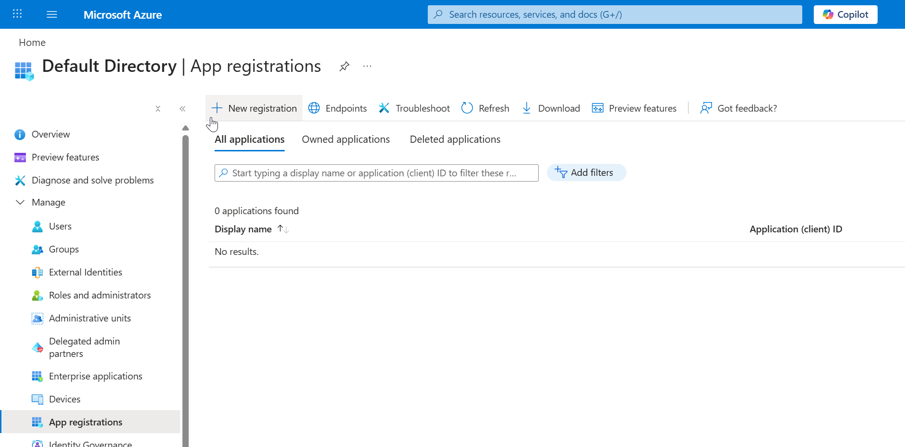
*Creating a new application registration in Microsoft Entra ID.*

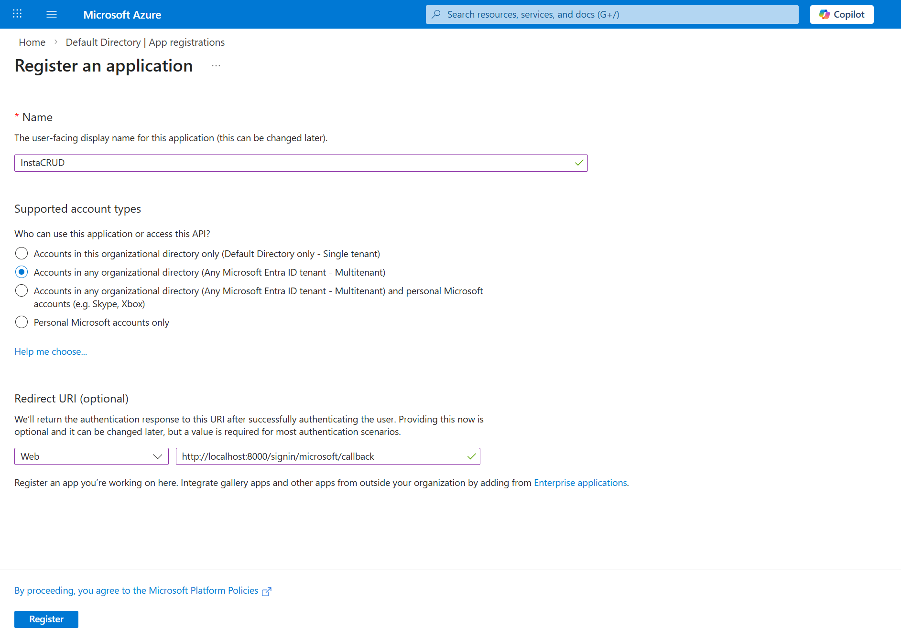
*Configuring application registration settings including supported account types and redirect URI.*

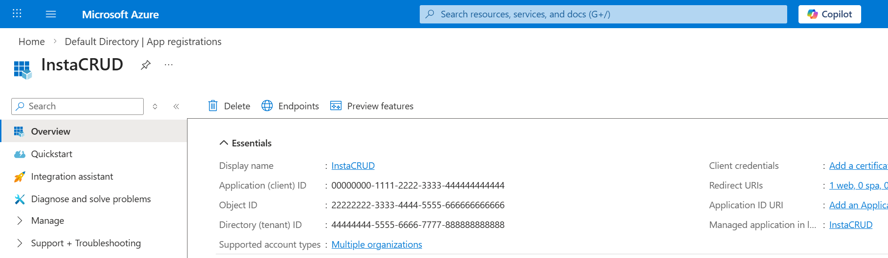
*Application overview page. Copy the **Application (client) ID** for backend configuration.*

---

## Step 2: Create Client Secret

1. In your app registration, go to **Certificates & secrets**
2. Click **New client secret**
3. Add a description (e.g., "InstaCRUD Backend")
4. Select expiration (24 months recommended)
5. Click **Add**
6. **Copy the secret value immediately**

> ⚠️ The secret value will not be visible again after leaving or refresh the page.

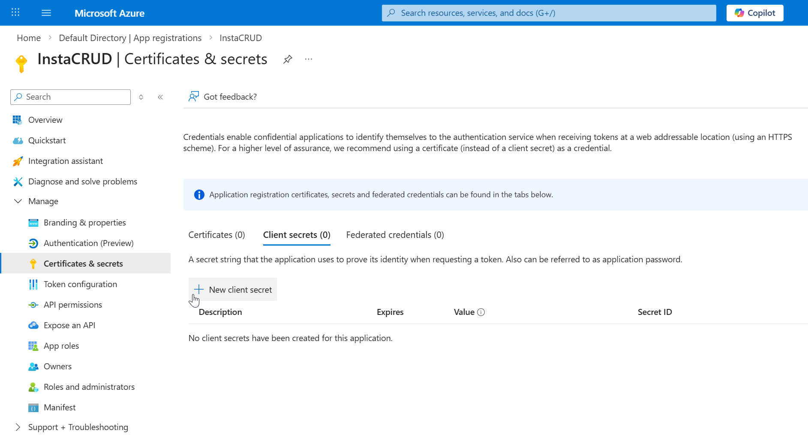
*Navigate to the **Certificates & secrets** section inside your app registration.*

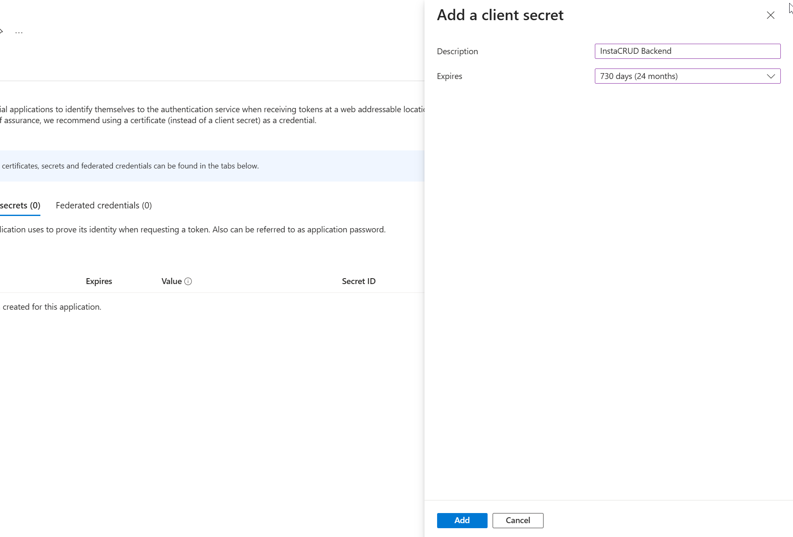
*Creating a new client secret for InstaCRUD backend authentication.*

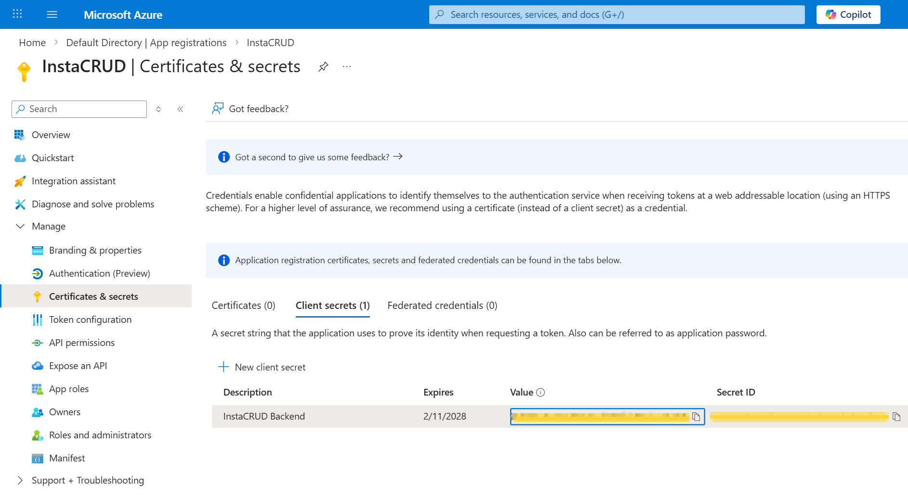
*Copy the **client secret value** immediately. It will not be shown again.*

---

## Step 3: Configure API Permissions

1. Go to **API permissions**
2. Click **Add a permission**
3. Select **Microsoft Graph**
4. Choose **Delegated permissions**
5. Add:
   - `email`
   - `openid`
   - `profile`
   - `User.Read`
6. Click **Add permissions**

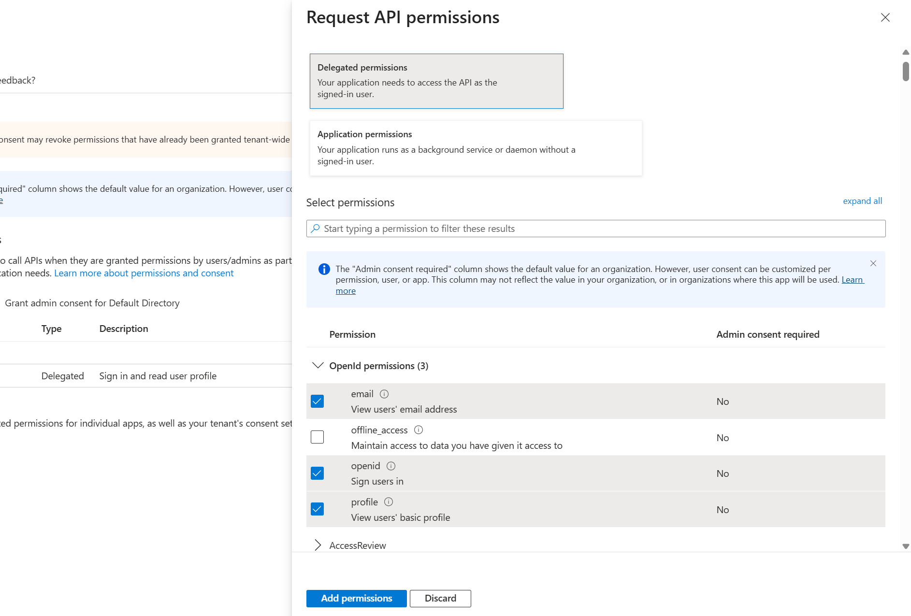
*Adding Microsoft Graph delegated permissions required for authentication.*

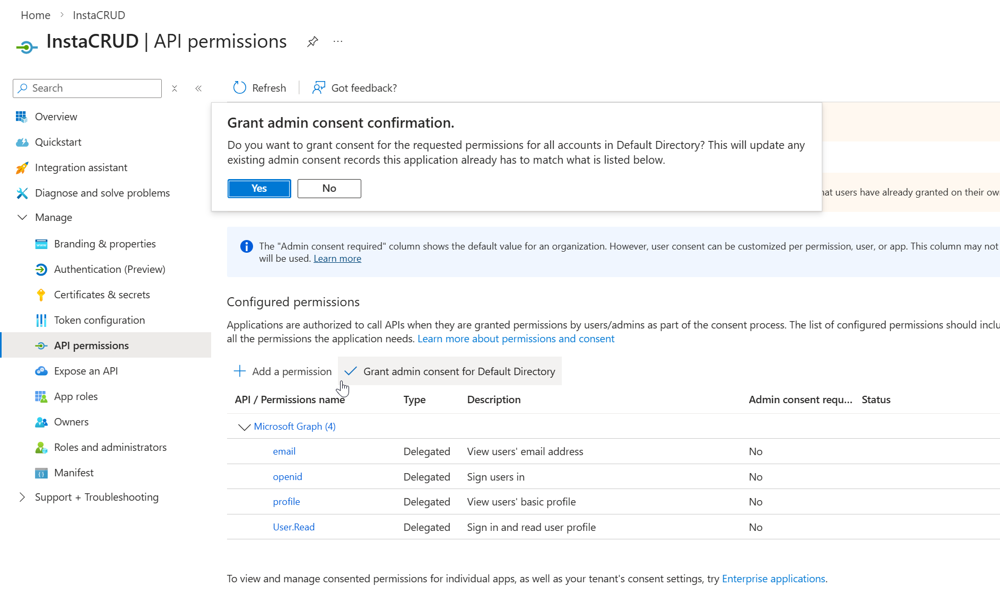
*Granting admin consent to allow organization-wide access without user approval prompts.*

### Admin Consent (Optional)

For organization-wide access without user consent prompts:

1. Click **Grant admin consent for [Organization]**
2. Confirm the action

---

## Step 4: Configure Redirect URIs

1. Go to **Authentication**
2. Under **Web > Redirect URIs**, add all environments:

```
http://localhost:8000/api/v1/signin/microsoft/callback
http://localhost:8000/api/v1/signup/microsoft/callback
https://your-domain.com/api/v1/signin/microsoft/callback
https://your-domain.com/api/v1/signup/microsoft/callback
```

3. Under **Implicit grant and hybrid flows**, enable:
   - **Access tokens**
   - **ID tokens**

4. Click **Save**

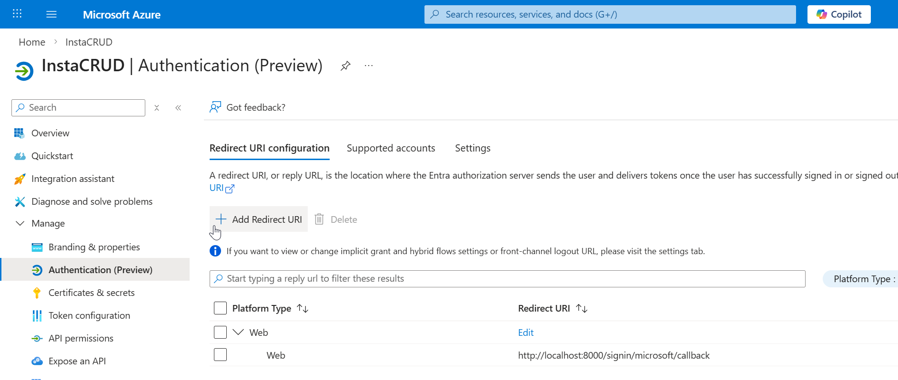
*Authentication configuration page showing existing redirect URIs.*

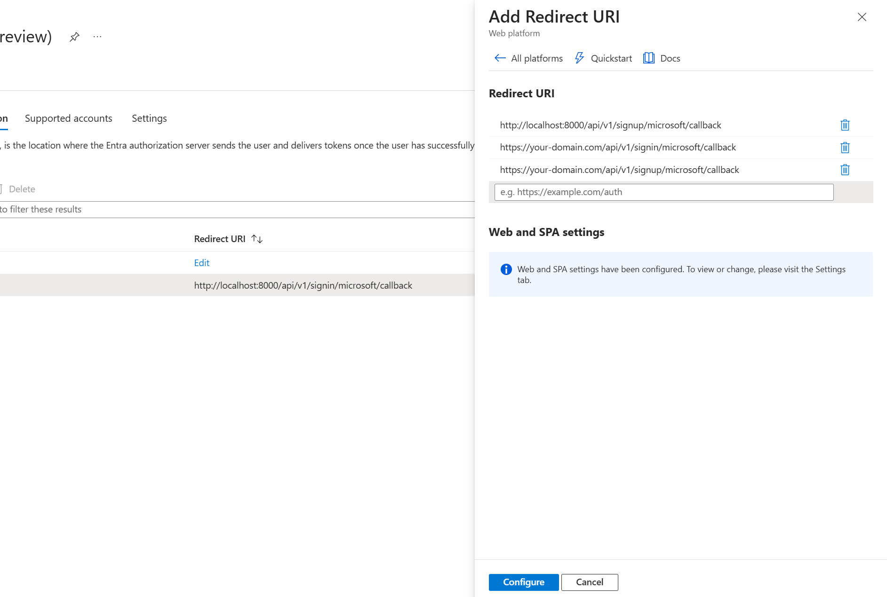
*Adding redirect URIs for different environments.*

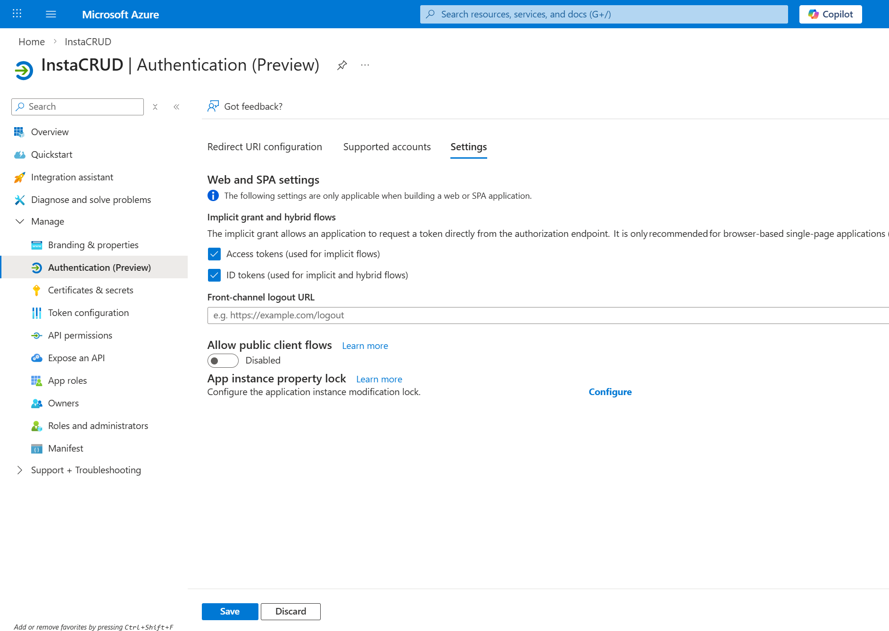
*Enabling ID tokens and Access tokens under Implicit grant and hybrid flows.*

---

## Step 5: Configure InstaCRUD

Add credentials to your backend `.env` file:

```bash
# Microsoft OAuth
MS_CLIENT_ID=your-application-client-id
MS_CLIENT_SECRET=your-client-secret-value
MS_TENANT_ID=common
```

### Tenant ID Options

| Value           | Description                                    |
| --------------- | ---------------------------------------------- |
| `common`        | Any Microsoft account (personal + work/school) |
| `organizations` | Only work/school accounts                      |
| `consumers`     | Only personal Microsoft accounts               |
| `{tenant-id}`   | Specific organization only                     |

---

## Step 6: Verify Configuration

Restart the backend server. The OAuth endpoint should be available:

```
GET /api/v1/signin/microsoft
```

This redirects users to Microsoft's consent screen.

---

## Environment-Specific Setup

### Local Development

```
Redirect URIs:
http://localhost:8000/api/v1/signin/microsoft/callback
http://localhost:8000/api/v1/signup/microsoft/callback
```

### ngrok Development

```
Redirect URIs:
https://your-backend.ngrok-free.app/api/v1/signin/microsoft/callback
https://your-backend.ngrok-free.app/api/v1/signup/microsoft/callback
```

### Production

```
Redirect URIs:
https://api.your-domain.com/api/v1/signin/microsoft/callback
https://api.your-domain.com/api/v1/signup/microsoft/callback
```

---

## Single-Tenant Configuration

For internal applications restricted to one organization:

1. Set **Supported account types** to **Single tenant**
2. Use your organization's tenant ID:

```bash
MS_TENANT_ID=your-tenant-id-guid
```

Find your tenant ID in:

**Azure Portal → Microsoft Entra ID → Overview**

---

## Troubleshooting

### "AADSTS50011: Reply URL Mismatch"

* Redirect URI must match exactly
* Check for trailing slashes
* Verify protocol (http vs https)

### "AADSTS7000215: Invalid Client Secret"

* Client secret may have expired
* Create a new secret and update `.env`
* Ensure no extra whitespace

### "AADSTS700016: Application Not Found"

* Verify `MS_CLIENT_ID` is correct
* Check the application exists in the correct tenant

### "Consent Required" Loop

* Grant admin consent in Azure Portal
* Ensure required permissions are configured

---

## Security Recommendations

1. **Rotate secrets regularly** — Track expiration dates
2. **Use separate app registrations** — One for development, one for production
3. **Limit permissions** — Only request required scopes
4. **Monitor sign-ins** — Review Entra ID sign-in logs

---

## Summary

Microsoft OAuth configuration requires:

1. Azure app registration with correct account type
2. Client secret (keep secure, track expiration)
3. API permissions for user profile access
4. Redirect URIs for all environments
5. Environment variables in InstaCRUD backend
