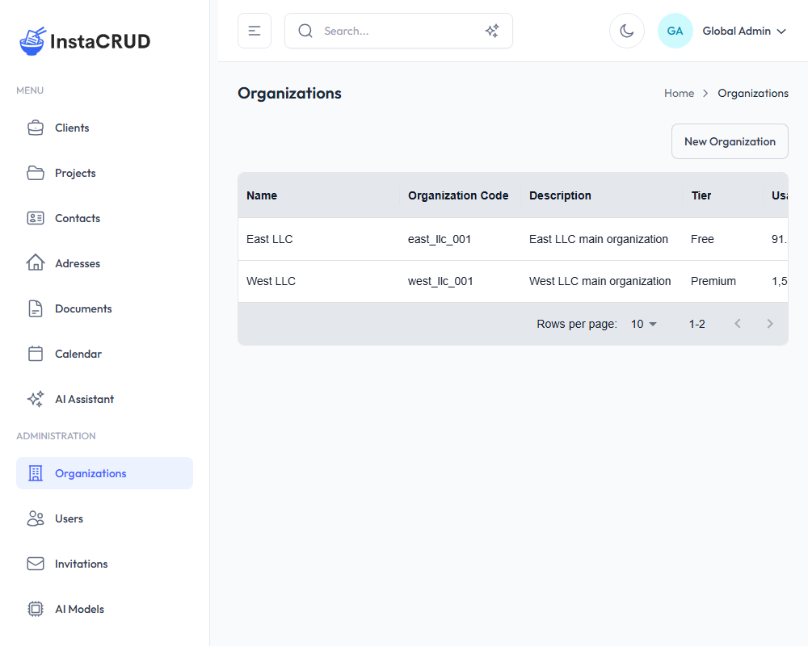
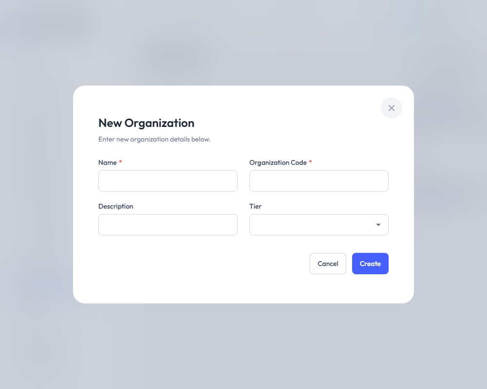
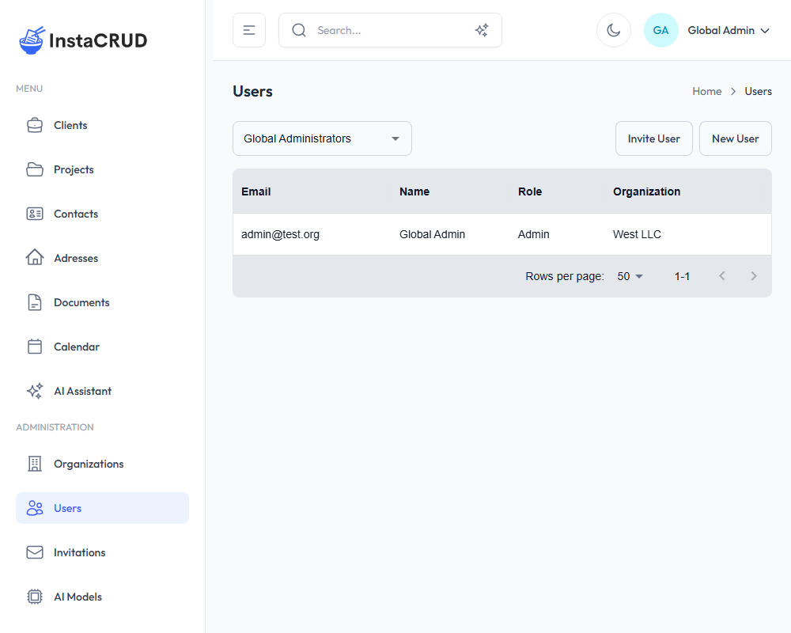
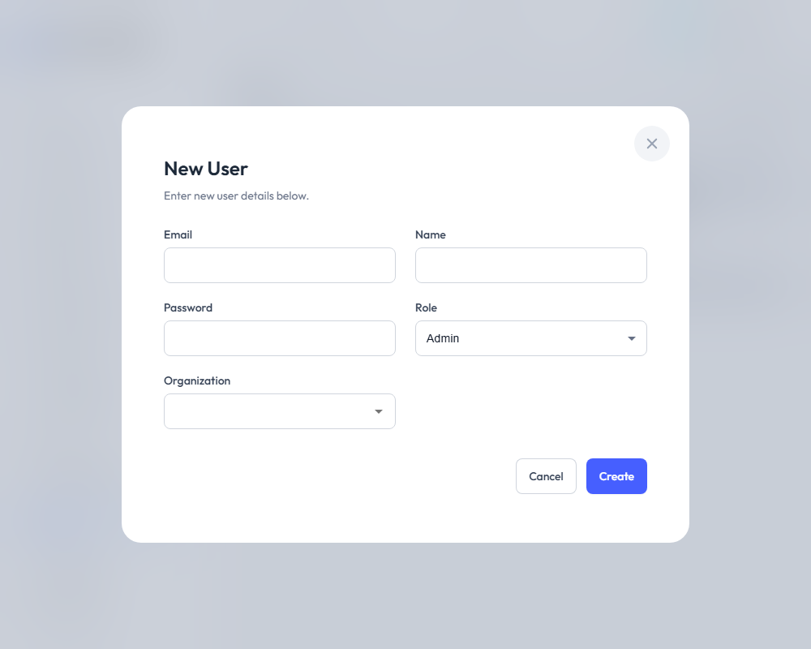
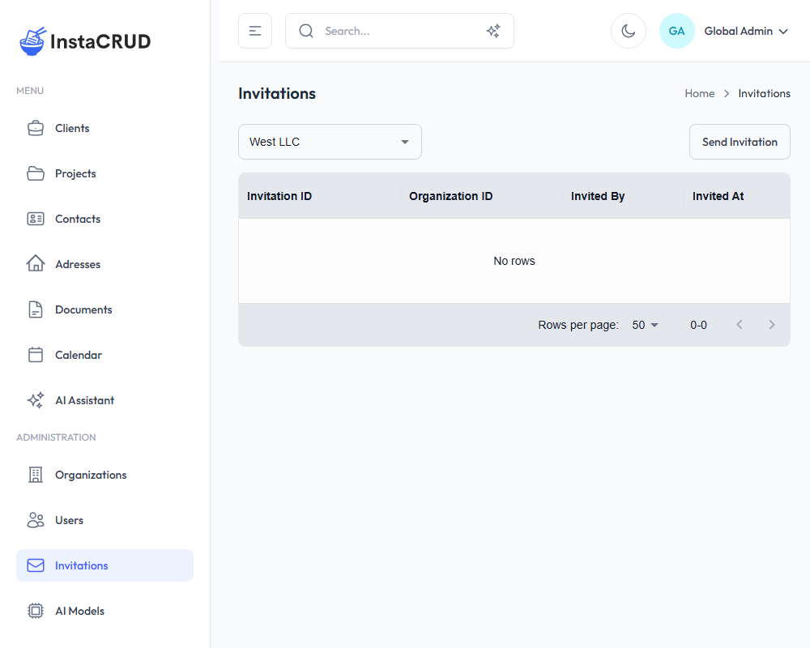
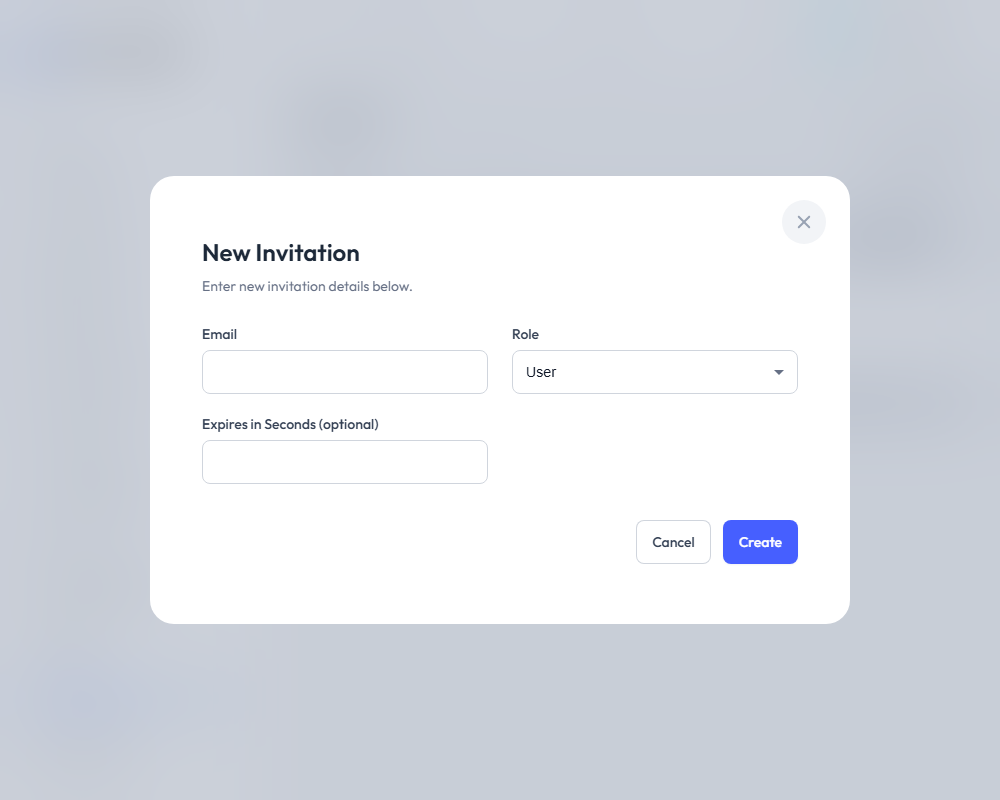

# Administration

The Administration section provides tools for managing organizations, users, and invitations. These features are available to users with Admin or Org Admin roles.

---

## Role Requirements

| Feature | Admin | Org Admin | User |
|---------|:-----:|:---------:|:----:|
| Organizations | Full access | View own | - |
| Users | Full access | Own org only | - |
| Invitations | Full access | Own org only | - |

---

## Organizations

Organizations are the top-level entities that group users and data. Each organization operates as an isolated tenant.

### Organizations List

Navigate to **Organizations** from the Administration menu.

The list displays:
- **Name** - Organization display name
- **Code** - Unique identifier
- **Description** - Organization details
- **Tier** - Subscription tier
- **Actions** - Edit and delete options

:::note
Only Admin users can access the Organizations management page.
:::

---

### Creating an Organization

1. Click the **New Organization** button
2. Fill in the organization details:

| Field | Required | Description |
|-------|----------|-------------|
| **Name** | Yes | Organization display name |
| **Code** | Yes | Unique identifier (e.g., "ACME") |
| **Description** | No | Additional information |
| **Tier** | No | Select subscription tier (Admin only) |

3. Click **Save** to create the organization

---

### Organization Tiers

Each organization can be assigned a subscription tier that determines:
- AI usage limits
- Available features
- Cost structure

See [AI Models & Tiers](./ai-models-tiers) for more information.

---

### Deleting an Organization

:::warning
Deleting an organization is a significant action. It may affect all users and data within that organization.
:::

1. Navigate to the organization detail view
2. Click **Delete**
3. A confirmation dialog will appear
4. Confirm to permanently delete the organization

---

## Users

Users are individual accounts that can access the system. Each user belongs to an organization and has a specific role.

### Users List

Navigate to **Users** from the Administration menu.

**For Admin users:**
- Use the organization selector at the top to filter users
- View users from any organization
- Check "Global Administrators" to see admins without an organization

**For Org Admin users:**
- See only users within your organization

The list displays:
- **Email** - User's email address (login)
- **Name** - Display name
- **Role** - User's role (Admin, Org Admin, User)
- **Organization** - User's organization
- **Actions** - Edit and delete options

---

### Creating a User

1. Click the **New User** button
2. Fill in the user details:

| Field | Required | Description |
|-------|----------|-------------|
| **Email** | Yes | Email address (used for login) |
| **Name** | Yes | Full display name |
| **Password** | Yes | Initial password |
| **Role** | Yes | Select user role |
| **Organization** | Yes | Select organization (Admin only can choose) |

3. Click **Save** to create the user

### Role Restrictions

- **Admins** can create users with any role in any organization
- **Org Admins** can only create users with User or Org Admin roles in their organization
- **Org Admins** cannot assign the Admin role

---

### User Roles

| Role | Description |
|------|-------------|
| **Admin** | Full system access, can manage all organizations |
| **Org Admin** | Manages users and data within their organization |
| **User** | Standard access to assigned resources |

---

### Editing a User

1. Click on a user in the list
2. Click **Edit**
3. Modify user details (password can be left blank to keep current)
4. Click **Save**

---

### Deleting a User

1. Navigate to the user detail view
2. Click **Delete**
3. A confirmation dialog will appear
4. Confirm to permanently delete the user

:::warning
Deleted users cannot recover their account. All associated session data will be removed.
:::

---

## Invitations

Invitations allow you to invite new users to join the system via email.

### Invitations List

Navigate to **Invitations** from the Administration menu.

**For Admin users:**
- Use the organization selector to filter invitations
- View invitations for any organization

The list displays:
- **Email** - Invited email address
- **Role** - Role assigned to invitation
- **Status** - Pending, accepted, or expired
- **Actions** - View and delete options

---

### Sending an Invitation

1. Click the **Send Invitation** button
2. Fill in the invitation details:

| Field | Required | Description |
|-------|----------|-------------|
| **Email** | Yes | Email address to invite |
| **Role** | Yes | Role for the new user |
| **Expires in Seconds** | No | Custom expiration time (optional) |

3. Click **Send** to create and send the invitation

### Invitation Process

1. An invitation email is sent to the specified address
2. The recipient clicks the link in the email
3. They complete their account setup
4. The invitation is marked as accepted

---

### Invitation Status

| Status | Description |
|--------|-------------|
| **Pending** | Invitation sent, awaiting acceptance |
| **Accepted** | User has completed registration |
| **Expired** | Invitation link has expired |

---

### Invitation vs. Direct User Creation

| Feature | Invitation | Direct Creation |
|---------|------------|-----------------|
| Email required | Yes | Yes |
| Password | User sets own | Admin sets |
| Verification | Email link | None |
| Best for | External users | Internal users |

---

### Deleting an Invitation

1. Find the invitation in the list
2. Click **Delete**
3. Confirm the deletion

Deleting a pending invitation prevents the recipient from using the link.

---

## Best Practices

### Organizations
- Use clear, descriptive names
- Create consistent code formats
- Assign appropriate tiers based on needs
- Review organization settings regularly

### Users
- Assign minimum necessary roles
- Use invitations for external users
- Review user list periodically
- Remove inactive users promptly

### Invitations
- Set reasonable expiration times
- Follow up on pending invitations
- Delete unused invitations
- Track invitation acceptance rates

---

## Troubleshooting

### Cannot See Organizations
- Verify you have Admin role
- Check that you're logged in correctly
- Contact your administrator

### Cannot Create Users
- Check your role permissions
- Verify organization access
- Ensure all required fields are filled

### Invitation Not Received
- Check spam/junk folders
- Verify email address is correct
- Resend the invitation
- Check email service configuration
