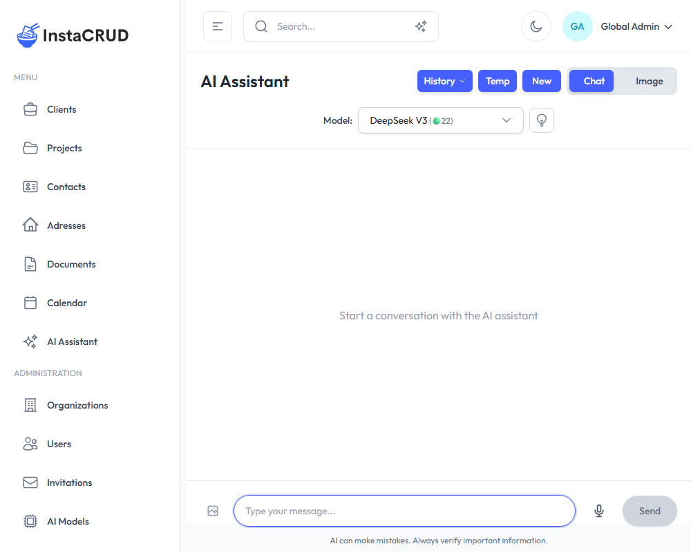
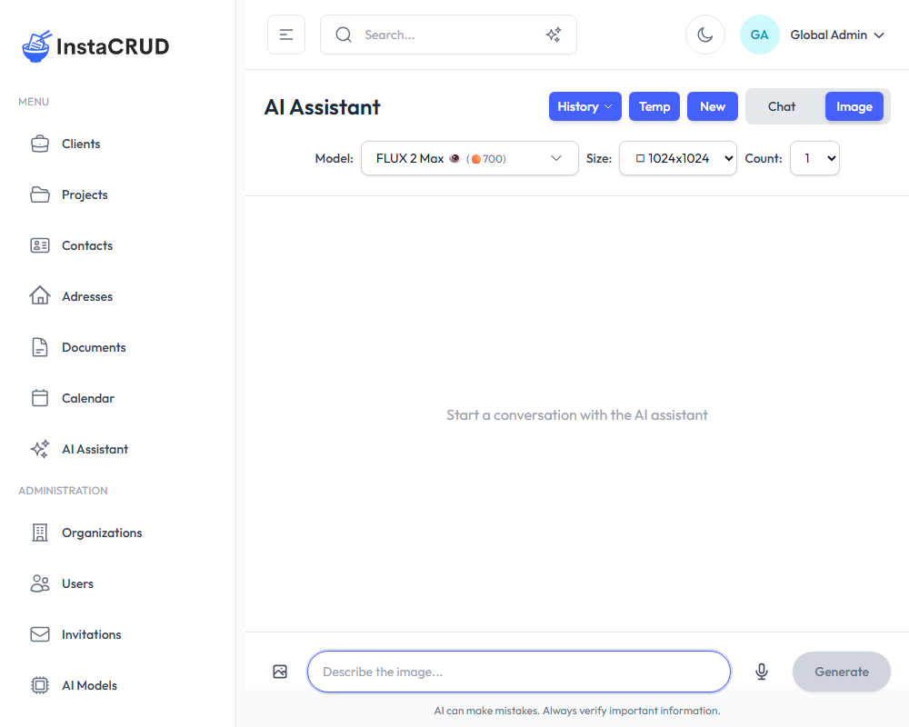

# AI Assistant

The AI Assistant provides powerful AI capabilities including conversational chat and image generation. It integrates with various AI models to help you with tasks, answer questions, and create images.

---

## Accessing the AI Assistant

Navigate to **AI Assistant** from the sidebar to open the chat interface.

---

## Chat Mode

Chat mode is the default interface for conversational AI interactions.

### Starting a Conversation

1. Navigate to the AI Assistant
2. Type your message in the input field at the bottom
3. Press **Enter** or click the send button
4. The AI will respond with helpful information

### Conversation Features

**Message History**
- Your conversations are automatically saved
- Scroll up to view previous messages
- Use the conversation dropdown to switch between conversations

**Model Selection**
- Select different AI models from the dropdown
- Available models depend on your organization's tier
- Different models have different capabilities and costs

**Image Attachments**
- Click the attachment button to add images
- The AI can analyze and discuss uploaded images
- Preview attached images before sending

### Managing Conversations

**Create New Conversation**
- Click the **New** button to start a fresh conversation
- Each conversation gets a unique ID

**Switch Conversations**
- Use the conversation dropdown to see your history
- Click on a conversation to load it

**Delete Conversations**
- Delete individual conversations from the dropdown menu
- Use **Delete All** to clear your entire history

**Temp Mode**
- Toggle temp mode to prevent conversation saving
- Useful for sensitive or one-time queries

---

## Image Generation Mode

Switch to image generation mode to create AI-generated images.

### Generating Images

1. Click the mode toggle to switch to **Image Generation**
2. Enter a detailed description of the image you want
3. Configure generation options:
   - **Resolution** - Select image dimensions
   - **Quality** - Choose standard or high quality
   - **Count** - Number of images to generate
4. Click **Generate**
5. View generated images in the chat

### Image Generation Options

| Option | Description |
|--------|-------------|
| **Resolution** | Choose from multiple size options (e.g., 1024x1024) |
| **Quality** | Standard or HD quality |
| **Image Count** | Generate 1-4 images at once |

### Viewing Generated Images

- Generated images appear in the conversation
- Click on an image to view it in a larger modal
- Right-click to save or copy images

---

## Reasoning Mode

Some AI models support extended thinking capabilities.

### Using Reasoning Mode

1. Toggle the **Reasoning** option (if available)
2. Ask complex questions requiring analysis
3. The AI will show its reasoning process
4. View detailed reasoning in a modal

### When to Use Reasoning

- Complex analytical problems
- Multi-step calculations
- Decisions requiring careful consideration
- Technical or logical reasoning tasks

---

## Advanced Features

### Streaming Responses

- AI responses stream in real-time
- Watch text appear as it's generated
- **Stop** button available to halt generation

### Copy to Input

- Click the copy button on AI responses
- The response is copied to your input field
- Useful for refining or continuing prompts

### Resync Data

- Click the **Resync** button to refresh conversation data
- Useful if conversations seem out of sync

### Error Handling

If the AI encounters an error:
1. An error message will display
2. Click **Retry** to regenerate the response
3. Or modify your prompt and try again

---

## AI Usage and Limits

Your organization has an AI usage quota based on your subscription tier.

### Checking Usage

- View current usage on the **Profile** page
- The AI Usage card shows:
  - Current usage count
  - Total limit
  - Percentage used
  - Reset date

### Usage Tips

- Complex queries may use more credits
- Image generation typically uses more credits than chat
- Check usage regularly to avoid hitting limits

See [Profile & AI Usage](./profile) for more details on monitoring your quota.

---

## Running AI locally with Ollama

All AI features work with locally hosted models via [Ollama](https://ollama.com/), giving you a fully private assistant with no cloud calls and no per-token costs. See [AI Assistant with Ollama](../getting-started/ollama-local-ai.md) for setup instructions and the list of pre-configured models.

---

## Best Practices

### Effective Prompting

- **Be specific** - Provide clear, detailed instructions
- **Give context** - Explain what you're trying to achieve
- **Use examples** - Show the AI what you're looking for
- **Iterate** - Refine your prompts based on responses

### Image Generation Tips

- **Describe clearly** - Include style, subject, colors, mood
- **Be detailed** - "A sunset over mountains" vs "A vibrant orange and pink sunset over snow-capped mountains, photorealistic style"
- **Specify style** - Mention art styles like "oil painting", "digital art", "photorealistic"
- **Include composition** - Describe framing, perspective, lighting

### Conversation Management

- Start new conversations for different topics
- Delete old conversations to keep things organized
- Use temp mode for sensitive queries
- Save important responses by copying them

---

## Troubleshooting

**AI Not Responding**
1. Check your internet connection
2. Try refreshing the page
3. Start a new conversation
4. Check if you've reached your usage limit

**Image Generation Failed**
1. Simplify your prompt
2. Try a different resolution
3. Check your usage quota
4. Contact support if issues persist

**Conversation Not Loading**
1. Click the Resync button
2. Refresh the page
3. Try selecting a different conversation
4. Start a new conversation if needed
