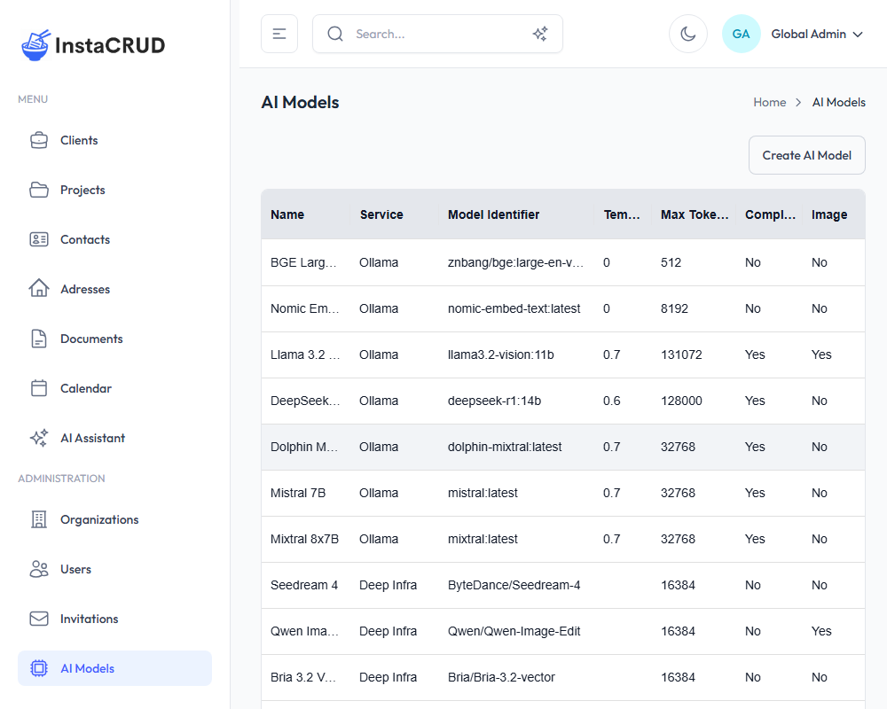
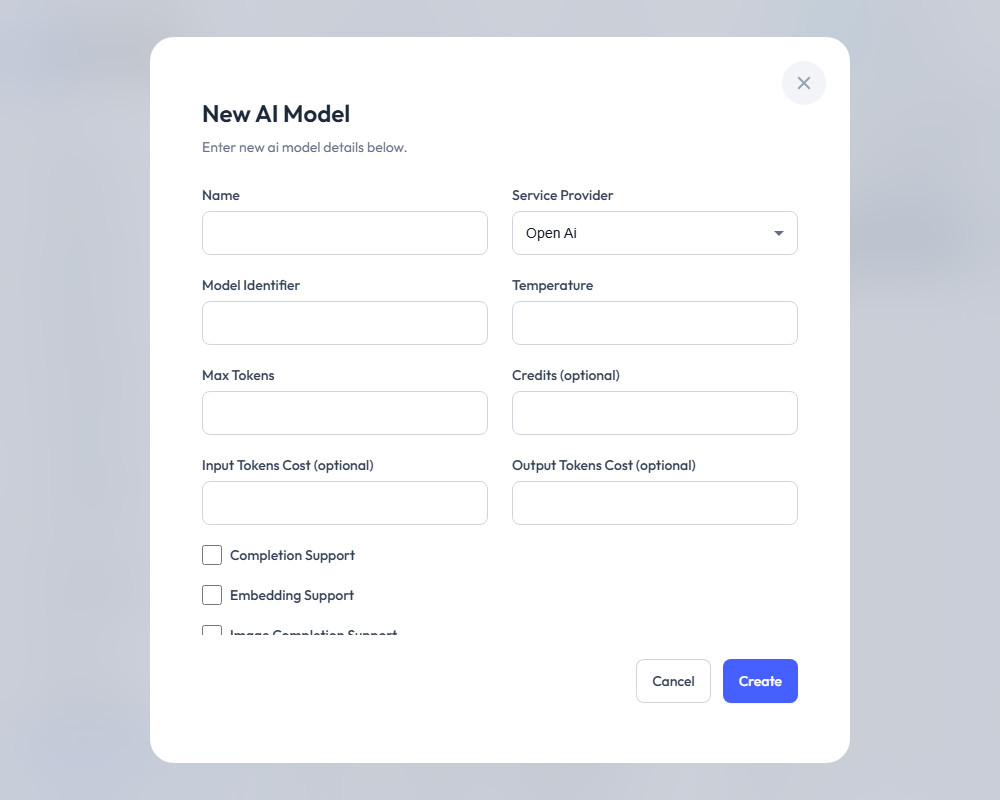
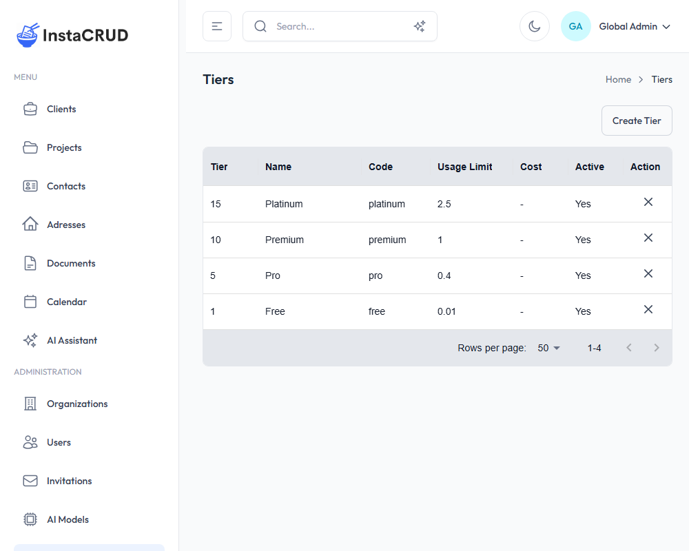
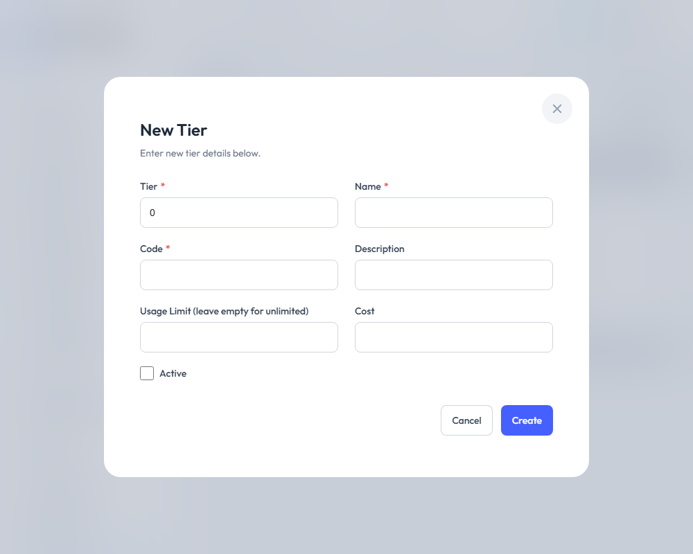

# AI Models & Tiers

AI Models and Tiers allow administrators to configure AI capabilities and define subscription levels for organizations. These features are only available to Admin users.

---

## AI Models

AI Models represent the configured AI services available in the system. Each model connects to an AI provider and has specific capabilities and costs.

### AI Models List

Navigate to **AI Models** from the Administration menu.



The list displays:
- **Name** - Model display name
- **Service Provider** - The AI service (e.g., OpenAI)
- **Model Identifier** - The API model ID
- **Capabilities** - Supported features (icons)
- **Enabled** - Active/inactive status
- **Actions** - Edit and delete options

---

### Creating an AI Model

1. Click the **Create AI Model** button
2. Fill in the model configuration:



#### Basic Settings

| Field | Required | Description |
|-------|----------|-------------|
| **Name** | Yes | Display name for the model |
| **Service Provider** | Yes | AI provider (OpenAI, etc.) |
| **Model Identifier** | Yes | API model ID (e.g., "gpt-4") |
| **Enabled** | No | Whether the model is active |
| **Rank** | No | Sort order in selection lists |

#### Model Parameters

| Field | Required | Description |
|-------|----------|-------------|
| **Temperature** | No | Randomness setting (0.0-1.0) |
| **Max Tokens** | No | Maximum response length |

#### Cost Tracking

| Field | Required | Description |
|-------|----------|-------------|
| **Credits** | No | Credits consumed per use |
| **Input Tokens Cost** | No | Cost per input token |
| **Output Tokens Cost** | No | Cost per output token |

#### Capabilities

| Checkbox | Description |
|----------|-------------|
| **Completion Support** | Can generate text responses |
| **Embedding Support** | Can create embeddings for semantic search |
| **Image Completion Support** | Can analyze images |
| **Image Generation Support** | Can generate images |

3. Click **Save** to create the model

---

### Model Configuration Guide

#### For Chat Models (GPT-4, Claude, etc.)

```
Name: GPT-4 Turbo
Service Provider: OPEN_AI
Model Identifier: gpt-4-turbo
Temperature: 0.7
Max Tokens: 4096
Completion Support: Yes
Image Completion Support: Yes (if vision capable)
Enabled: Yes
```

#### For Embedding Models

```
Name: Text Embedding 3
Service Provider: OPEN_AI
Model Identifier: text-embedding-3-small
Embedding Support: Yes
Enabled: Yes
```

#### For Image Generation Models

```
Name: DALL-E 3
Service Provider: OPEN_AI
Model Identifier: dall-e-3
Image Generation Support: Yes
Enabled: Yes
```

---

### Editing AI Models

1. Click on a model in the list
2. Click **Edit**
3. Modify settings as needed
4. Click **Save**

### Disabling vs. Deleting

- **Disable** - Uncheck "Enabled" to temporarily hide from users
- **Delete** - Permanently remove the model configuration

---

## Tiers

Tiers define subscription levels that control features and usage limits for organizations.

### Tiers List

Navigate to **Tiers** from the Administration menu.



The list displays:
- **Tier** - Tier level number
- **Name** - Display name
- **Code** - Unique identifier
- **Usage Limit** - AI usage quota
- **Cost** - Subscription cost
- **Active** - Whether tier is available
- **Actions** - Edit and delete options

---

### Creating a Tier

1. Click the **Create Tier** button
2. Fill in the tier details:



| Field | Required | Description |
|-------|----------|-------------|
| **Tier** | Yes | Tier level number (for ordering) |
| **Name** | Yes | Display name (e.g., "Premium") |
| **Code** | Yes | Unique code (e.g., "premium") |
| **Description** | No | What this tier includes |
| **Usage Limit** | No | AI usage quota (leave empty for unlimited) |
| **Cost** | No | Monthly/subscription cost |
| **Active** | No | Whether tier is available for assignment |

3. Click **Save** to create the tier

---

### Tier Configuration Examples

#### Free Tier
```
Tier: 1
Name: Free
Code: free
Usage Limit: 100
Cost: 0
Active: Yes
Description: Limited access for evaluation
```

#### Standard Tier
```
Tier: 2
Name: Standard
Code: standard
Usage Limit: 1000
Cost: 29
Active: Yes
Description: For small teams
```

#### Premium Tier
```
Tier: 3
Name: Premium
Code: premium
Usage Limit: 10000
Cost: 99
Active: Yes
Description: For growing businesses
```

#### Enterprise Tier
```
Tier: 4
Name: Enterprise
Code: enterprise
Usage Limit: (empty - unlimited)
Cost: 299
Active: Yes
Description: Unlimited usage for large organizations
```

---

### Usage Limits

The Usage Limit field controls how many AI credits an organization can use:

- **Set a number** - Limits usage to that amount
- **Leave empty** - Unlimited usage (no cap)

Usage is tracked per organization and resets periodically (see [Profile & AI Usage](./profile)).

---

### Assigning Tiers to Organizations

1. Navigate to **Organizations**
2. Edit the organization
3. Select a tier from the dropdown
4. Save the changes

The organization's AI usage will now be tracked against the tier's limit.

---

### Editing Tiers

1. Click on a tier in the list
2. Click **Edit**
3. Modify settings as needed
4. Click **Save**

:::note
Changing a tier's usage limit affects all organizations currently assigned to that tier.
:::

---

### Deactivating vs. Deleting Tiers

- **Deactivate** - Uncheck "Active" to prevent new assignments
- **Delete** - Permanently remove (ensure no organizations use it first)

---

## Managing AI Costs

### Tracking Model Costs

1. Configure input/output token costs for each model
2. Review usage through the Profile page
3. Monitor organization-level usage

### Optimizing Usage

- **Choose appropriate models** - Use smaller models for simple tasks
- **Set reasonable limits** - Prevent unexpected overages
- **Monitor regularly** - Review usage patterns
- **Adjust tiers** - Upgrade organizations as needed

---

## Best Practices

### AI Models
- Enable only models you've tested
- Set appropriate temperature for your use case
- Configure cost tracking for budgeting
- Use ranking to prioritize preferred models

### Tiers
- Create clear tier differentiation
- Use meaningful names and codes
- Document what each tier includes
- Review tier assignments regularly

---

## Troubleshooting

### Model Not Appearing in AI Assistant
- Check that "Enabled" is checked
- Verify the organization's tier allows the model
- Check model capabilities match intended use

### Usage Limit Not Working
- Verify tier is assigned to organization
- Check usage limit is set (not empty)
- Confirm usage tracking is active

### Cost Tracking Issues
- Ensure cost fields are filled for models
- Verify the correct service provider is selected
- Check model identifier matches the API
