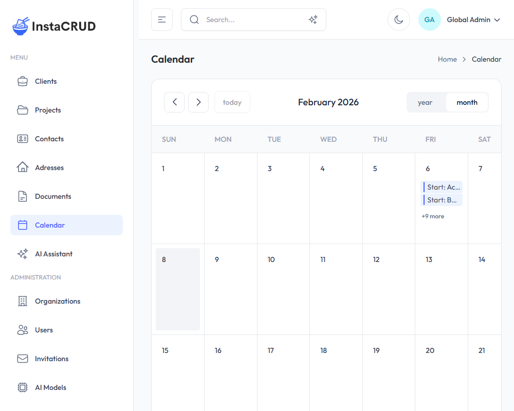

# Calendar

The Calendar provides a visual overview of events derived from your data entities. It displays dates from projects and other entities that have date fields.

---

## How It Works

The calendar automatically displays events from entities in the system. Currently, it shows:

- **Project Start Dates** - Displayed as "Start: [Project Name]"
- **Project End Dates** - Displayed as "End: [Project Name]"

Events are generated automatically based on the date fields in your data - there is no manual event creation.

---

## Calendar Views

The calendar supports two view options:

- **Month View** - Overview of the entire month (default)
- **Year View** - Overview of the entire year

Use the view selector buttons in the top-right corner to switch between views.

---

## Navigation

- Use the **arrow buttons** to move between time periods
- Click **Today** to return to the current date

---

## Working with Events

### Viewing Events

Events appear on their respective dates. When a day has many events, they are collapsed and a **"+X more"** link appears. Click this link to see all events for that day.

### Navigating to Entities

Click on any event to navigate directly to its source entity (e.g., clicking a project event takes you to that project's detail page).

---

## Event Colors

Events are color-coded by entity type for easy identification. Project events appear in blue.
