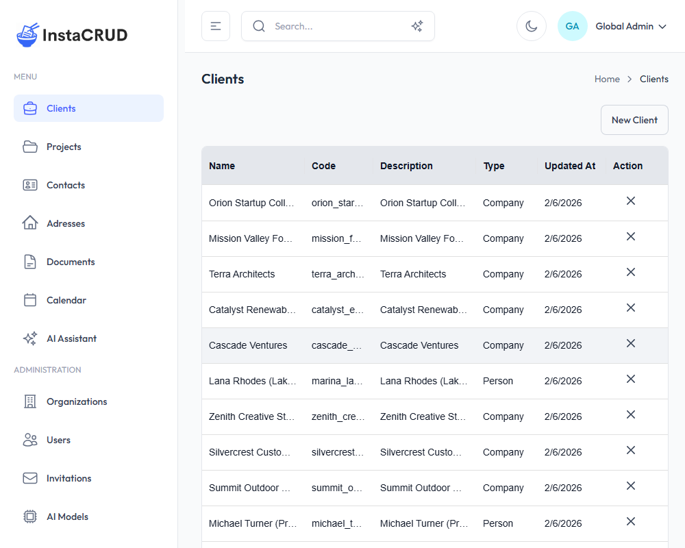
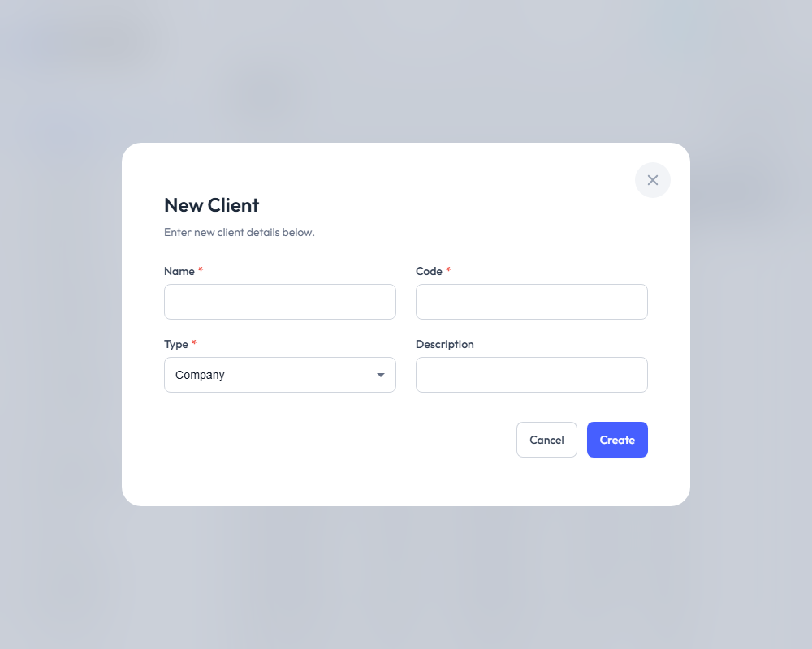
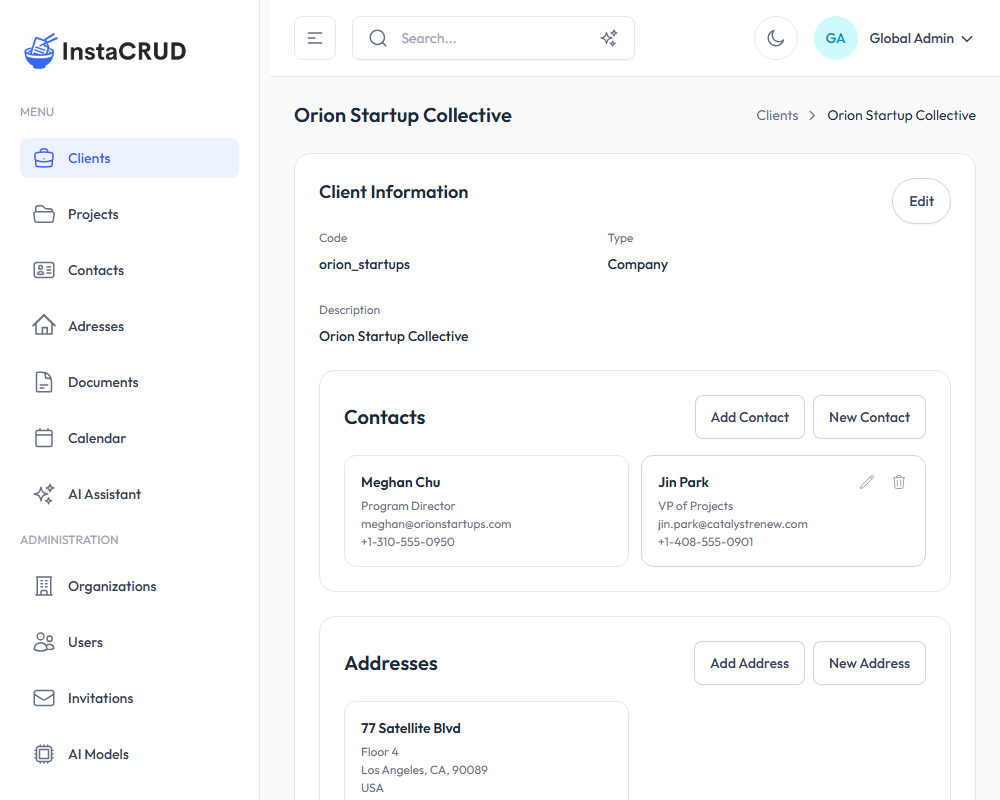

# Managing Clients

Clients are the core business entities in InstaCRUD. A client typically represents a customer organization or company that you work with.

---

## Clients List

Navigate to **Clients** from the sidebar to view all clients in your organization.

The list displays:
- **Name** - The client's name (click to view details)
- **Code** - A unique identifier code
- **Type** - The client type classification
- **Actions** - Edit and delete options

### Pagination

The clients list shows 10 records per page. Use the pagination controls at the bottom to navigate between pages.

---

## Creating a New Client

1. Click the **New Client** button in the top-right corner
2. Fill in the required fields:

| Field | Required | Description |
|-------|----------|-------------|
| **Name** | Yes | The client's display name |
| **Code** | Yes | A unique identifier (e.g., "ACME-001") |
| **Type** | Yes | Select from the available client types |
| **Description** | No | Additional notes about the client |

3. Click **Save** to create the client

---

## Client Detail View

Click on a client name to open the detail view.

The detail view shows:
- **Client Information** - Name, code, type, and description
- **Associated Contacts** - People linked to this client
- **Associated Addresses** - Addresses linked to this client
- **Projects** - Projects belonging to this client

### Editing Client Information

1. Click the **Edit** button
2. Modify the fields as needed
3. Click **Save** to apply changes

---

## Managing Client Contacts

From the client detail view, you can manage associated contacts:

### Adding an Existing Contact
1. In the **Contacts** section, click **Add Contact**
2. Select a contact from the dropdown
3. The contact will be linked to this client

### Creating a New Contact
1. Click **Create New** in the Contacts section
2. Fill in the contact details
3. The new contact will be automatically linked to this client

### Removing a Contact
1. Find the contact in the list
2. Click the remove/unlink button
3. The contact will be unlinked (not deleted)

---

## Managing Client Addresses

Similar to contacts, you can manage addresses:

### Adding an Existing Address
1. In the **Addresses** section, click **Add Address**
2. Select an address from the dropdown

### Creating a New Address
1. Click **Create New** in the Addresses section
2. Fill in the address details (street, city, state, zip, country)
3. The new address will be automatically linked

### Removing an Address
1. Find the address in the list
2. Click the remove/unlink button

---

## Viewing Client Projects

The client detail view displays all projects associated with this client. Click on any project to navigate to its detail page.

---

## Deleting a Client

1. Navigate to the client detail view or use the delete action in the list
2. Click **Delete**
3. Confirm the deletion when prompted

:::warning
Deleting a client may affect associated projects and data. Make sure you want to permanently remove this record.
:::

---

## Best Practices

- **Use meaningful codes** - Create a consistent code format (e.g., "COMPANY-001")
- **Keep descriptions updated** - Add notes about special requirements or preferences
- **Link all relevant contacts** - Ensure all stakeholders are associated with the client
- **Add complete addresses** - Include all client locations for reference
