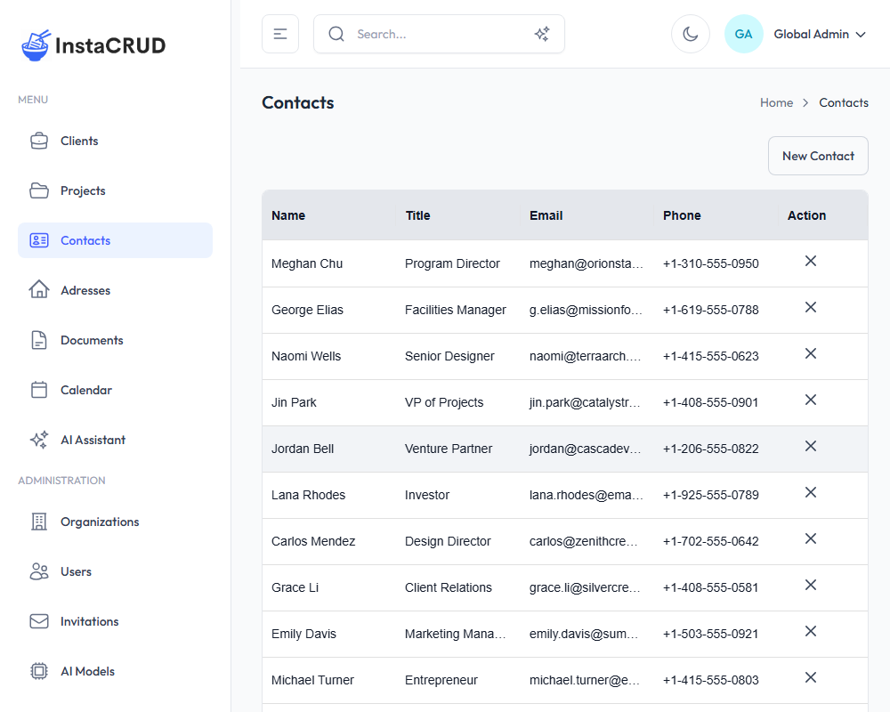
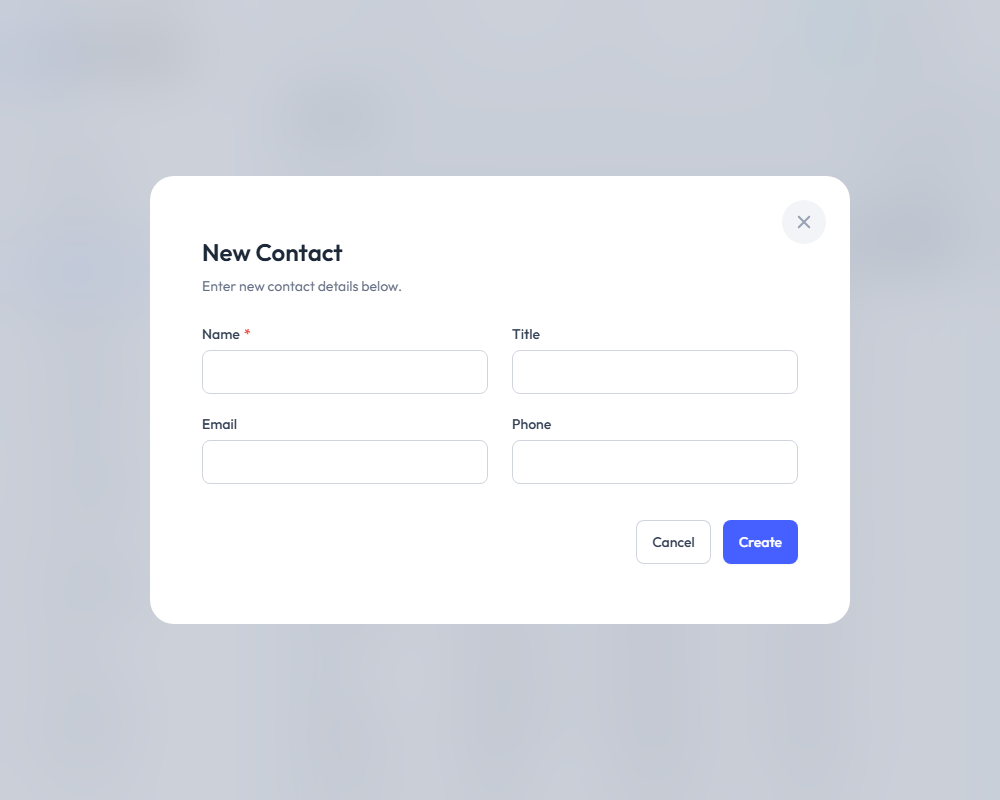
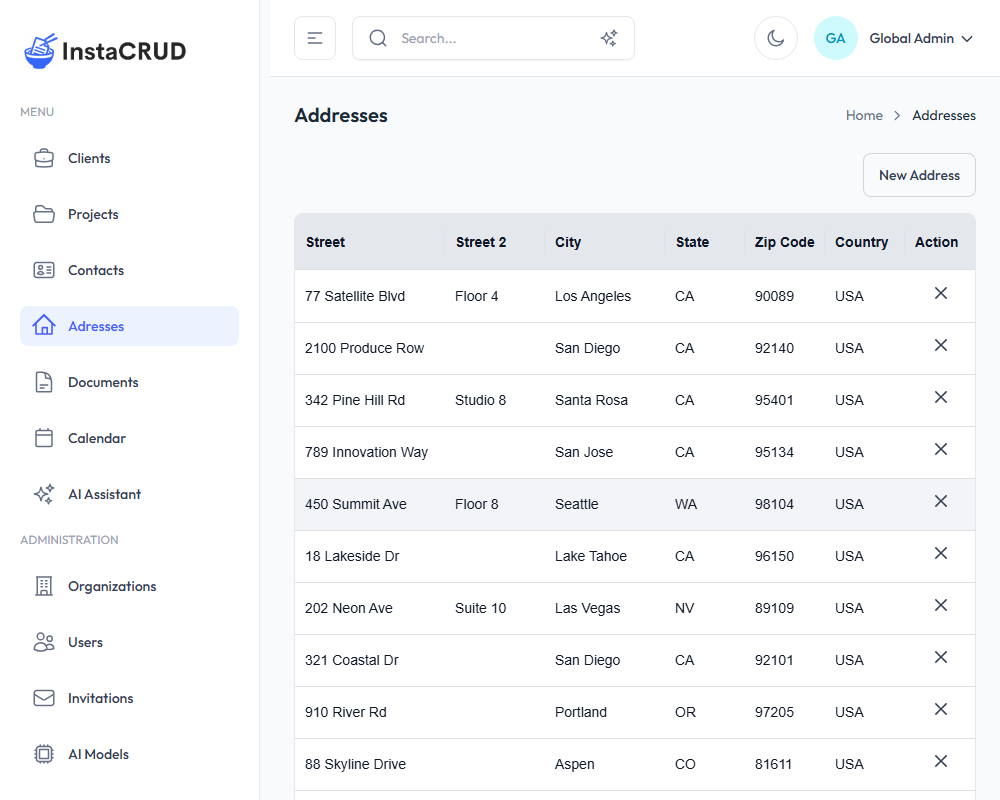
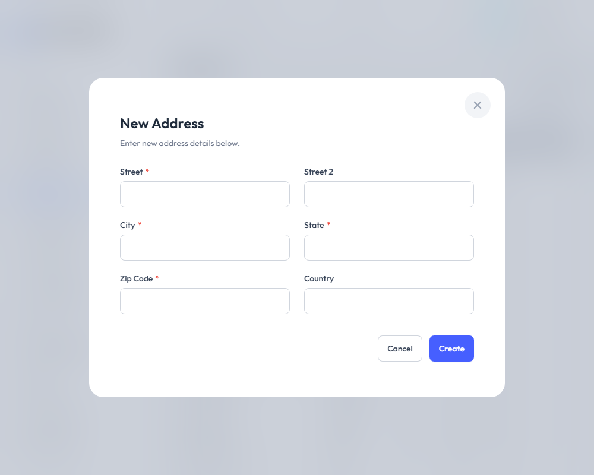

# Contacts & Addresses

Contacts and Addresses are standalone entities that can be linked to multiple clients, enabling you to reuse information across your organization.

---

## Contacts

Contacts represent individual people associated with your clients.

### Contacts List

Navigate to **Contacts** from the sidebar to view all contacts.

The list displays:
- **Name** - The contact's full name
- **Title** - Job title or role
- **Email** - Email address
- **Phone** - Phone number
- **Actions** - Edit and delete options

---

### Creating a New Contact

1. Click the **New Contact** button
2. Fill in the contact details:

| Field | Required | Description |
|-------|----------|-------------|
| **Name** | Yes | Full name of the contact |
| **Title** | Yes | Job title (e.g., "Project Manager") |
| **Email** | Yes | Email address |
| **Phone** | Yes | Phone number |

3. Click **Save** to create the contact

---

### Contact Detail View

Click on a contact name to view full details:
- All contact information
- Edit and delete options

---

### Linking Contacts to Clients

Contacts can be associated with multiple clients:

1. Navigate to a **Client** detail view
2. In the **Contacts** section, click **Add Contact**
3. Select the contact from the dropdown
4. The contact is now linked to that client

Alternatively, create a new contact directly from the client:
1. In the client's Contacts section, click **Create New**
2. Fill in the contact details
3. The contact is automatically linked

---

### Unlinking vs. Deleting

- **Unlinking** - Removes the association between a contact and client, but keeps the contact in the system
- **Deleting** - Permanently removes the contact and all its associations

---

## Addresses

Addresses are reusable location records that can be linked to clients.

### Addresses List

Navigate to **Addresses** from the sidebar.

The list displays:
- **Street** - Primary street address
- **City** - City name
- **State** - State or province
- **Zip Code** - Postal code
- **Country** - Country name
- **Actions** - Edit and delete options

---

### Creating a New Address

1. Click the **New Address** button
2. Fill in the address details:

| Field | Required | Description |
|-------|----------|-------------|
| **Street** | Yes | Primary street address |
| **Street 2** | No | Suite, unit, or additional info |
| **City** | Yes | City name |
| **State** | Yes | State or province |
| **Zip Code** | Yes | Postal/ZIP code |
| **Country** | Yes | Country name |

3. Click **Save** to create the address

---

### Address Detail View

Click on an address street name to view full details:
- Complete address information
- Edit and delete options

---

### Linking Addresses to Clients

Addresses work similarly to contacts:

1. Navigate to a **Client** detail view
2. In the **Addresses** section, click **Add Address**
3. Select the address from the dropdown
4. The address is now linked to that client

You can also create a new address directly from the client detail view.

---

### Common Use Cases

**Multiple Office Locations**
- Create one address per location
- Link all locations to the same client

**Shared Addresses**
- If multiple clients share an office building
- Create one address and link it to multiple clients

**Client Headquarters vs. Project Sites**
- Keep separate addresses for different purposes
- Link appropriate addresses to each client

---

## Best Practices

### Contacts
- **Use complete names** - Include first and last name
- **Keep titles current** - Update when roles change
- **Use work email/phone** - For business communications
- **Avoid duplicates** - Search before creating new contacts

### Addresses
- **Be consistent with formatting** - Use the same format for all addresses
- **Include suite/unit numbers** - Use the Street 2 field
- **Use full country names** - Avoid abbreviations for clarity
- **Update when clients move** - Keep addresses current

---

## Searching for Contacts and Addresses

Use the global search in the header to find contacts and addresses:

1. Click the search bar or press `Ctrl+K` / `Cmd+K`
2. Type the name, email, street, or city
3. Matching contacts and addresses appear in results
4. Click a result to navigate directly to it

The semantic search feature can also find related records based on context.
