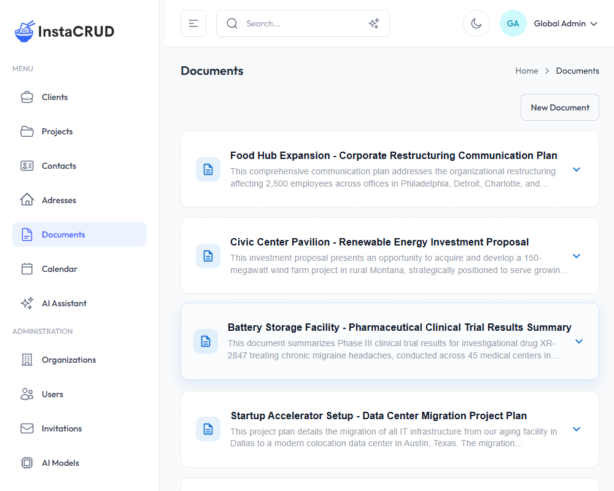
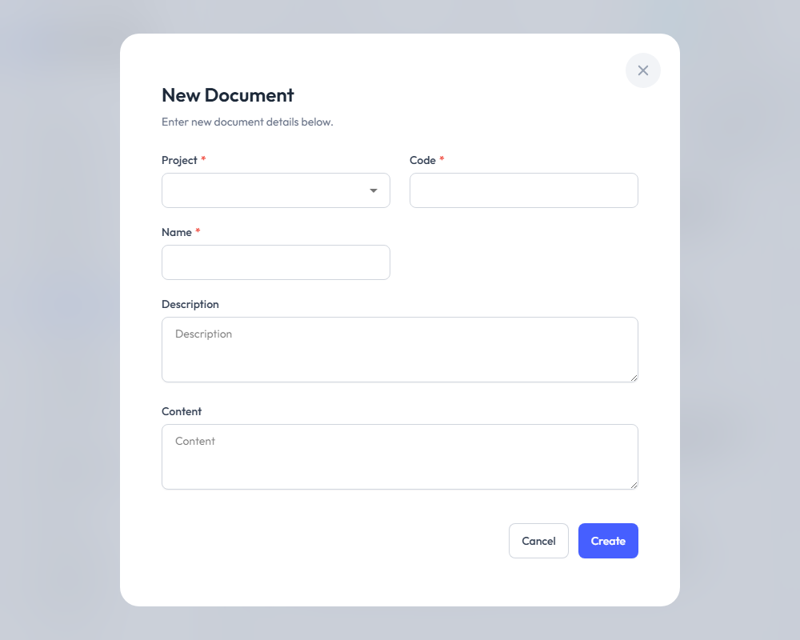
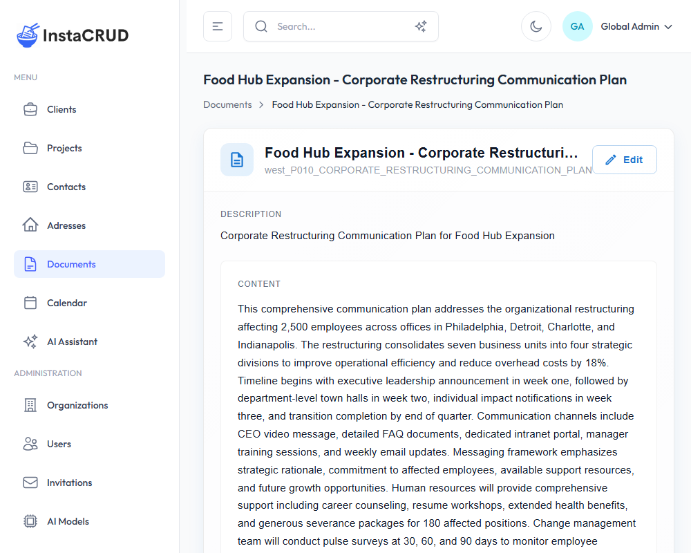

# Documents

Documents are content records associated with projects. Use them for specifications, notes, reports, or any project-related text content.

---

## Documents List

Navigate to **Documents** from the sidebar.

The documents list uses **infinite scroll** - as you scroll down, more documents load automatically.

The list displays:
- **Name** - Document name
- **Code** - Unique document identifier
- **Project** - The associated project
- **Description** - Brief description (if provided)
- **Actions** - Edit and delete options

---

## Creating a New Document

1. Click the **New Document** button
2. Fill in the document details:

| Field | Required | Description |
|-------|----------|-------------|
| **Project** | Yes | Select the project this document belongs to |
| **Code** | Yes | A unique identifier (e.g., "DOC-001") |
| **Name** | Yes | Document title |
| **Description** | No | Brief summary of the document |
| **Content** | No | The main document content (supports long text) |

3. Click **Save** to create the document

---

## Document Detail View

Click on a document name to view its full content:

- All document fields
- Full content display
- Link to associated project
- Graphical representation of document semantics
- Edit and delete options

## Editing Documents

1. Click the **Edit** button in the detail view
2. Modify any fields, including content
3. Click **Save** to apply changes

---

## Document Content

The **Content** field is a large text area that supports:
- Multi-paragraph text
- Technical specifications
- Meeting notes
- Requirements documentation
- Any long-form text content

---

## Organizing Documents

**By Project**
- All documents must belong to a project
- View all documents for a project from the project detail page

**Using Codes**
- Create a consistent code system
- Examples: "REQ-001" for requirements, "MTG-001" for meeting notes

**With Descriptions**
- Use clear descriptions for quick identification
- Helps when searching for documents

---

## Deleting Documents

1. Navigate to the document detail view
2. Click **Delete**
3. Confirm the deletion

:::warning
Deleted documents cannot be recovered. Consider exporting important content before deletion.
:::