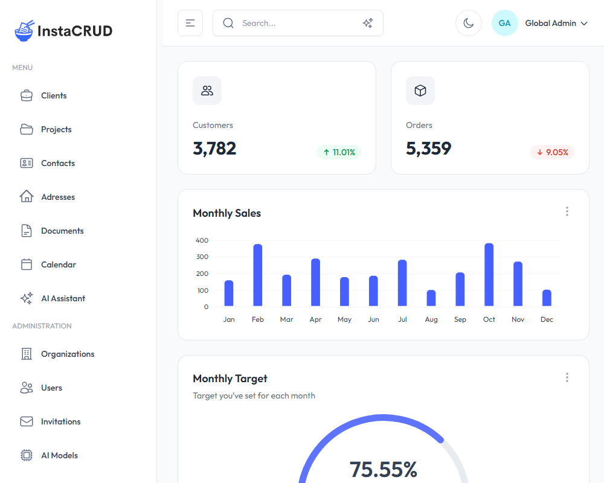

# User Guide

Welcome to the InstaCRUD User Guide. This documentation will help you understand how to use the InstaCRUD application to manage your business data effectively.

---

## Application Layout

InstaCRUD features a clean, modern interface with the following main areas:

### Sidebar Navigation

The sidebar on the left provides access to all application modules:

**Menu**
- **Clients** - Manage your client organizations
- **Projects** - Track projects linked to clients
- **Contacts** - Store contact information for individuals
- **Addresses** - Manage address records
- **Documents** - Create and manage project documentation
- **Calendar** - View and manage scheduled events
- **AI Assistant** - Chat with AI and generate images

**Administration** (Admin users only)
- **Organizations** - Manage tenant organizations
- **Users** - Create and manage user accounts
- **Invitations** - Send and track user invitations
- **AI Models** - Configure AI model settings
- **Tiers** - Define subscription tiers and usage limits

### Header Bar

The header contains:
- **Search** - Quick search across all entities (supports text and semantic search)
- **Theme Toggle** - Switch between light and dark modes
- **User Menu** - Access your profile and sign out

---

## User Roles

InstaCRUD uses role-based access control with three main roles:

| Role | Description | Access Level |
|------|-------------|--------------|
| **Admin** | System administrator | Full access to all features and all organizations |
| **Org Admin** | Organization administrator | Manage users and data within their organization |
| **User** | Standard user | Access to assigned resources and basic features |

---

## Common Actions

Throughout the application, you'll find consistent patterns for managing data:

### Creating New Records
1. Navigate to the desired module (e.g., Clients)
2. Click the **New** button (or similar action button)
3. Fill in the required fields in the modal form
4. Click **Save** to create the record

### Editing Records
1. Click on a record in the list to open its detail view
2. Click the **Edit** button
3. Modify the fields as needed
4. Click **Save** to apply changes

### Deleting Records
1. Locate the record in the list or detail view
2. Click the **Delete** button
3. Confirm the deletion when prompted

### Searching
- Use the search bar in the header for quick searches
- Toggle between text search and semantic (AI-powered) search
- Click on results to navigate directly to records

---

## Quick Start

1. **Sign In** - Use your credentials to access the application
2. **Explore the Dashboard** - View key metrics and statistics
3. **Create a Client** - Navigate to Clients and add your first client
4. **Add a Project** - Create a project linked to your client
5. **Use AI Assistant** - Try the AI chat for help with tasks

---

## Next Steps

Explore the detailed guides for each module:

- [Managing Clients](./clients.md)
- [Managing Projects](./projects.md)
- [Contacts & Addresses](./contacts-addresses.md)
- [Documents](./documents.md)
- [Calendar](./calendar.md)
- [AI Assistant](./ai-assistant.md)
- [Search Features](./search.md)
- [Administration](./administration.md)
- [Profile & AI Usage](./profile.md)
