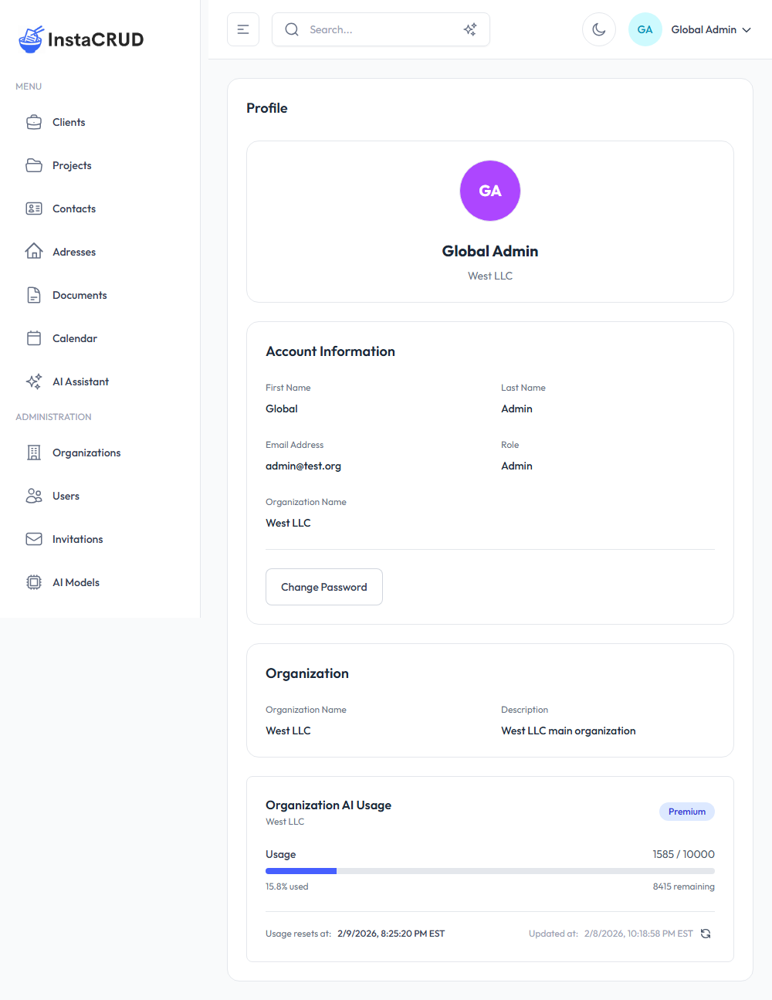
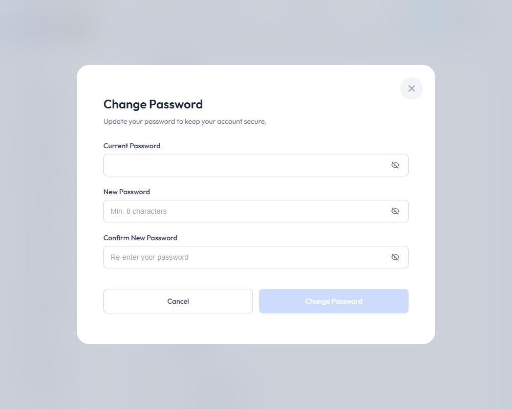

# Profile & AI Usage

The Profile page displays your account information, organization details, and AI usage statistics. Access it from the user menu in the header.

---

## Accessing Your Profile

1. Click your name/avatar in the header
2. Select **Profile** from the dropdown menu

---

## Profile Sections

### User Card

The top section displays your identity:

- **Avatar** - Colored circle with your initials
- **First Name** and **Last Name**
- **Organization Name** - Your current organization

---

### Account Information

View your account details:

| Field | Description |
|-------|-------------|
| **First Name** | Your first name |
| **Last Name** | Your last name |
| **Email Address** | Your login email |
| **Role** | Your assigned role (Admin, Org Admin, User) |
| **Organization Name** | Your organization |

:::note
To update your name or email, contact your administrator. These fields are read-only in the profile view.
:::

---

### Change Password

Update your account password:

1. Click the **Change Password** button
2. Enter your **Current Password**
3. Enter your **New Password** (minimum 8 characters)
4. **Confirm** the new password
5. Click **Save** to update

#### Password Requirements

- Minimum 8 characters
- New password and confirmation must match
- Current password must be correct

#### Visibility Toggle

Click the eye icon to show/hide password characters while typing.

---

### Organization Information

View details about your organization:

| Field | Description |
|-------|-------------|
| **Organization Name** | Your organization's display name |
| **Description** | Organization details and notes |

---

## AI Usage Statistics

The AI Usage card shows your organization's AI consumption:

### Usage Display

| Element | Description |
|---------|-------------|
| **Organization Name** | Which organization this applies to |
| **Tier Name** | Your subscription tier (e.g., "Premium") |
| **Progress Bar** | Visual usage indicator |
| **Usage Numbers** | Current / Limit (e.g., "1585 / 10000") |
| **Percentage** | How much of your quota is used |
| **Remaining** | Credits still available |
| **Reset Date** | When your usage quota resets |
| **Updated Date** | When stats were last refreshed |

### Progress Bar Colors

The progress bar changes color based on usage level:

| Usage Level | Color | Meaning |
|-------------|-------|---------|
| 0-74% | Green | Healthy usage |
| 75-89% | Yellow | Approaching limit |
| 90%+ | Red | Near or at limit |

### Unlimited Tiers

If your organization has an unlimited tier:
- Usage is still tracked
- No limit is displayed
- Progress bar shows absolute usage

---

## Refreshing Usage Data

1. Click the **Refresh** button on the AI Usage card
2. The latest usage statistics are fetched
3. The "Updated at" timestamp reflects the refresh

Usage data may take a moment to update after AI operations.

---

## Understanding Usage

### What Counts as Usage

AI usage is tracked when:
- Sending messages in AI Assistant
- Generating images
- Using semantic search
- Any AI model invocation

### Usage Credits

Different operations may consume different amounts:
- Simple chat messages: Lower credit usage
- Long responses: Higher credit usage
- Image generation: Higher credit usage
- Semantic search: Moderate credit usage

### Usage Reset

Your organization's usage typically resets:
- At a regular interval (daily, monthly)
- The exact reset time is shown on the profile page
- After reset, usage returns to 0

---

## Managing Your Account

### Best Practices

1. **Monitor usage regularly** - Check the profile page weekly
2. **Update password periodically** - Change every 3-6 months
3. **Use strong passwords** - Mix letters, numbers, symbols
4. **Know your limits** - Understand your tier's quota

### If You're Approaching the Limit

When usage reaches 75%+:
1. Review your AI usage patterns
2. Consider which operations are essential
3. Contact your administrator about tier upgrades
4. Plan usage carefully until reset

### If You've Reached the Limit

At 100% usage:
- AI features may be limited
- Wait for usage reset, or
- Request a tier upgrade from your administrator

---

## Troubleshooting

### Cannot Change Password

- Verify current password is correct
- Ensure new password meets requirements
- Check that confirmation matches
- Try refreshing the page

### Usage Not Updating

- Click the refresh button
- Wait a few moments and try again
- Check your internet connection
- Contact support if issues persist

### Wrong Organization Shown

- Log out and log back in
- Clear browser cache
- Contact your administrator

### Role Appears Incorrect

- Roles are assigned by administrators
- Contact your admin if you need different access
- Note: Role changes require re-login to take effect

---

## Privacy and Security

### Your Data

- Profile information is stored securely
- Passwords are encrypted
- Session data expires after inactivity

### Security Recommendations

1. **Don't share your password**
2. **Log out on shared computers**
3. **Report suspicious activity** to administrators
4. **Use unique passwords** for InstaCRUD

### Session Management

- Sessions expire after a period of inactivity
- You'll be redirected to sign-in when expired
- Multiple device sessions may be active
