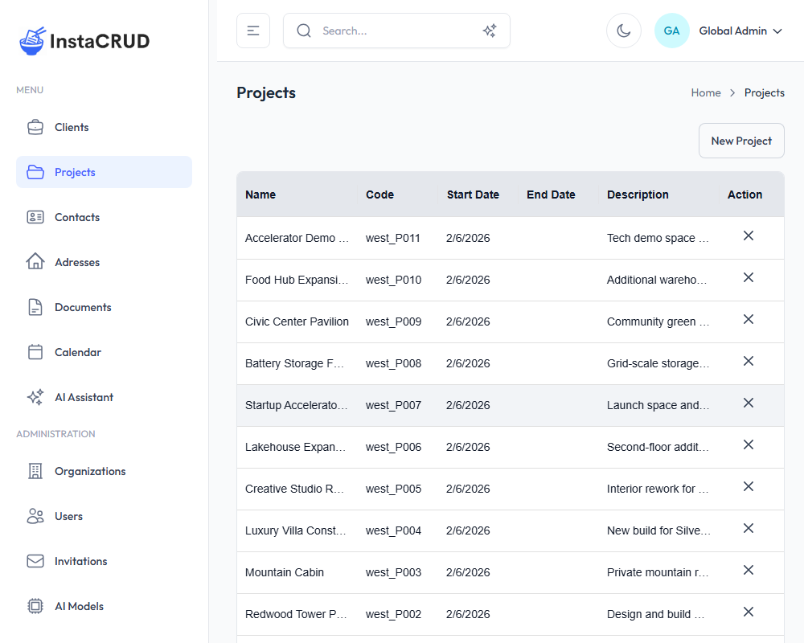
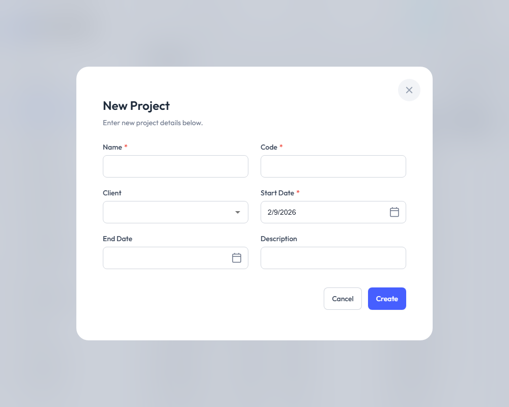
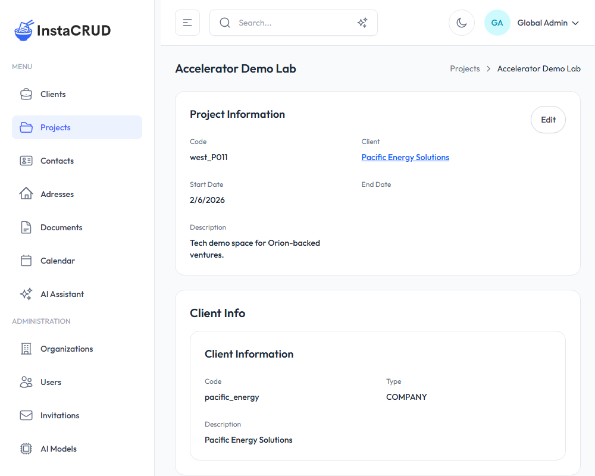

# Managing Projects

Projects represent work initiatives or engagements tied to specific clients. Each project belongs to exactly one client and can have multiple documents associated with it.

---

## Projects List

Navigate to **Projects** from the sidebar to view all projects.

The list displays:
- **Name** - The project name (click to view details)
- **Code** - A unique project identifier
- **Client** - The associated client
- **Start Date** - When the project begins
- **End Date** - When the project is expected to end (if set)
- **Actions** - Edit and delete options

---

## Creating a New Project

1. Click the **New Project** button
2. Fill in the project details:

| Field | Required | Description |
|-------|----------|-------------|
| **Name** | Yes | The project's display name |
| **Code** | Yes | A unique identifier (e.g., "PROJ-2024-001") |
| **Client** | Yes | Select the client this project belongs to |
| **Start Date** | Yes | The project start date |
| **End Date** | No | The expected completion date |
| **Description** | No | Project scope, goals, or notes |

3. Click **Save** to create the project

---

## Project Detail View

Click on a project name to open the detail view.

The detail view shows:
- **Project Information** - All project fields
- **Client Link** - Click to navigate to the associated client
- **Associated Documents** - Documents linked to this project

### Editing Project Information

1. Click the **Edit** button
2. Modify the fields as needed
3. Click **Save** to apply changes

---

## Working with Project Dates

### Start Date
- Required when creating a project
- Use the date picker to select the date
- Format: Displayed in your locale format

### End Date
- Optional field
- Leave empty for ongoing projects
- Update when project scope becomes clearer

---

## Changing the Project's Client

You can reassign a project to a different client:

1. Open the project for editing
2. Use the Client dropdown to select a new client
3. Save the changes

:::note
Reassigning a project does not affect associated documents.
:::

---

## Project Documents

Projects can have multiple documents attached. From the project detail view:

1. View the list of associated documents
2. Click on a document to view its details
3. Create new documents directly from this section

To create a document for this project:
1. Navigate to **Documents** in the sidebar
2. Create a new document
3. Select this project in the Project field

---

## Deleting a Project

1. Navigate to the project detail view
2. Click **Delete**
3. Confirm the deletion

:::warning
Deleting a project may affect associated documents. Review related data before deleting.
:::

---

## Project Status Tracking

While InstaCRUD doesn't have a built-in status field, you can track project status by:

- **Using descriptions** - Add status notes to the description field
- **Using dates** - Projects with past end dates are effectively completed
- **Creating documents** - Use status update documents to track progress

---

## Best Practices

- **Use consistent code formats** - Example: "CLIENT-YYYY-NNN" format
- **Set realistic end dates** - Update as the project progresses
- **Link to the correct client** - Verify the client before saving
- **Document milestones** - Create documents to track important project updates
- **Keep descriptions current** - Update project scope as it evolves
