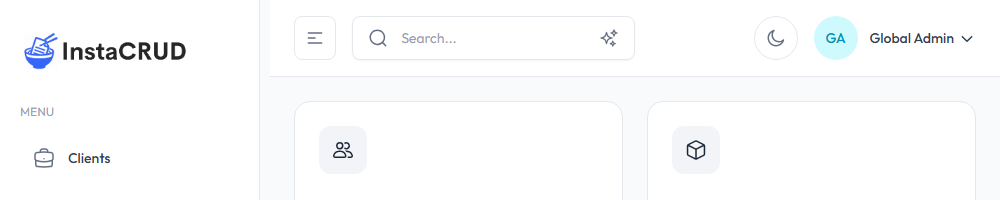

# Search Features

InstaCRUD provides powerful search capabilities to help you quickly find information across all your data. The search includes both traditional text search and AI-powered semantic search.

---

## Accessing Search

The search bar is located in the header and is available from any page.

### Quick Access

- **Click** the search bar in the header
- **Keyboard shortcut**: Press `Ctrl+K` (Windows/Linux) or `Cmd+K` (Mac)

---

## Text Search

Text search is the default search mode. It finds records by matching keywords in your data.

### How It Works

1. Click the search bar or use the keyboard shortcut
2. Type at least **3 characters** to start searching
3. Results appear automatically as you type
4. Click a result to navigate to that record

### Search Behavior

- **Real-time results** - Results update as you type (with 300ms debounce)
- **Minimum length** - Requires at least 3 characters
- **Cross-entity search** - Searches across all entity types
- **Field matching** - Matches names, codes, descriptions, and other text fields

### What's Searched

The text search looks across all major entities:
- Clients (name, code, description)
- Projects (name, code, description)
- Contacts (name, title, email)
- Addresses (street, city, state, country)
- Documents (name, code, description, content)
- Organizations (name, code)
- Users (name, email)

---

## AI Search

AI Search uses semantic vector search technology to understand the meaning of your query, not just keywords. This approach uses AI embeddings to represent both your query and the data as vectors in a high-dimensional space, finding results that are conceptually similar even without exact keyword matches.

### Enabling AI Search

1. Click the **sparkle icon** in the search bar to toggle AI Search mode
2. The icon will highlight when AI Search is active
3. Type your query (minimum 3 characters)
4. Press **Enter** to execute the search

### How It Works

AI Search uses semantic vector embeddings to:
- Understand the intent behind your query
- Find conceptually related results
- Match based on meaning, not just exact words

### Example Queries

| Query | Finds |
|-------|-------|
| "project deadlines next month" | Projects with upcoming end dates |
| "contact at tech company" | Contacts associated with technology clients |
| "requirements documentation" | Documents about requirements |
| "New York office" | Addresses and clients in New York area |

### Semantic vs. Text Search

| Feature | Text Search | AI Search |
|---------|-------------|-----------------|
| Trigger | Real-time as you type | Press Enter |
| Matching | Exact keyword matching | Meaning-based matching |
| Speed | Very fast | Slightly slower (AI processing) |
| Results | Exact matches only | Related and relevant results |
| Use case | Known keywords | Exploratory search |

---

## Search Results

### Result Display

Each result shows:
- **Entity name** - The record's display name
- **Entity type** - Which module the record belongs to (e.g., "Clients")
- **Semantic indicator** - Shows "Semantic" badge for AI-powered results

### Navigating Results

1. Click on any result to navigate to that record
2. Results open in the appropriate detail view
3. Use keyboard arrows to navigate results (if supported)
4. Press Escape to close the search dropdown

---

## Search Tips

### For Text Search

- **Use specific terms** - "ACME" instead of "client"
- **Try different variations** - "New York", "NY", "NYC"
- **Include codes** - Search by project or client codes
- **Partial matching** - Type partial words for broader results

### For AI Search

- **Use natural language** - "all projects starting this quarter"
- **Describe what you need** - "contact information for decision makers"
- **Be specific about context** - "documents about security requirements"
- **Think conceptually** - Search for ideas, not just keywords

---

## Common Use Cases

### Finding a Client
1. Start typing the client name or code
2. Results appear showing matching clients
3. Click to open the client detail

### Locating a Contact
1. Search by name, email, or job title
2. Results show matching contacts
3. Navigate directly to the contact

### Finding Documents
1. Search by document name or content keywords
2. Enable AI Search for topic-based queries
3. Click to view the full document

### Cross-Entity Discovery
1. Use AI Search for complex queries
2. Example: "all information about Project Alpha"
3. Results include project, documents, and related records

---

## Troubleshooting

### No Results Found

- Check spelling and try variations
- Reduce the search to fewer words
- Try AI Search for conceptual queries
- Verify the data exists in the system

### AI Search Not Working

- Ensure you pressed Enter after typing
- Check that the sparkle icon is active
- Try simpler, clearer queries
- Verify AI features are enabled for your organization

### Slow Search Results

- Text search should be instant; try refreshing the page
- AI Search takes a moment for AI processing
- Check your internet connection
- Complex queries may take longer

---

## Best Practices

1. **Start with text search** for known entities
2. **Switch to AI Search** when you're not finding what you need
3. **Use specific terms** when possible
4. **Keep queries concise** - 2-5 words is often ideal
5. **Learn your data patterns** - Understand how records are named and coded
